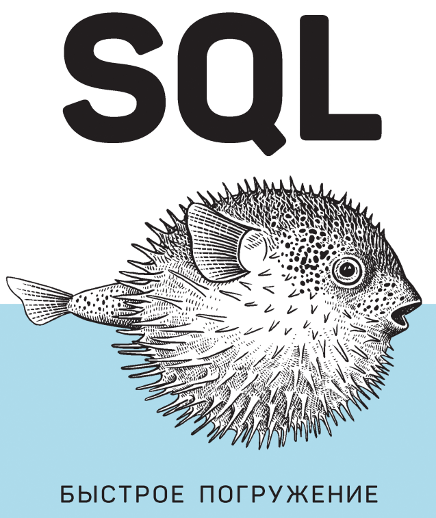

# SQL-QuickStart-Guide

practical exercises from the book

- ## [Структура базы данных](thesis/CHAPTER1.MD) ## 
    - [Основная-терминология](thesis/CHAPTER1.MD#основная-терминология)
    - [Основные элементы реляционных баз данных](thesis/CHAPTER1.MD#основные-элементы-реляционных-баз-данных)
    - [Типы данных](thesis/CHAPTER1.MD#типы-данных)
        + [Числовые типы данных](thesis/CHAPTER1.MD#числовые-типы-данных)
        + [Целочисленные типы](thesis/CHAPTER1.MD#целочисленные-типы)
        + [Числа с фиксированной точностью](thesis/CHAPTER1.MD#числа-с-фиксированной-точностью)
        + [Типы с плавающей точкой](thesis/CHAPTER1.MD#типы-с-плавающей-точкой)
        + [Последовательные типы](thesis/CHAPTER1.MD#последовательные-типы)
        + [Денежные типы](thesis/CHAPTER1.MD#денежные-типы)
        + [Символьные, или текстовые, типы данных](thesis/CHAPTER1.MD#символьные-или-текстовые-типы-данных)
        + [Дата и время](thesis/CHAPTER1.MD#дата-и-время)
        + [Логический тип данных](thesis/CHAPTER1.MD#логический-тип-данных)
    - [Системы управления реляционными базами данных](thesis/CHAPTER1.MD#системы-управления-реляционными-базами-данных)
    - [Оператор SELECT](thesis/CHAPTER1.MD#оператор-select)

- ## [Работа с базой данных](thesis/CHAPTER3.MD) ## 
    - [Добавление базы](thesis/CHAPTER3.MD#добавление-базы)
    - [Структура базы данных](thesis/CHAPTER3.MD#структура-базы-данных)
    - [Просмотр индивидуальных записей](thesis/CHAPTER3.MD#просмотр-индивидуальных-записей)
    - [Вкладка Execute SQL](thesis/CHAPTER3.MD#вкладка-execute-sql)

- ## [Работа с запросами ](thesis/CHAPTER4.MD) ## 
    - [Добавление комментариев к запросам](thesis/CHAPTER4.MD#добавление-комментариев-к-запросам)
    - [Общая структура запроса](thesis/CHAPTER4.MD#общая-структура-запроса)
    - [Синтаксис и соглашение о кодировании](thesis/CHAPTER4.MD#синтаксис-и-соглашение-о-кодировании)
    - [Использование псевдонима (alias)](thesis/CHAPTER4.MD#использование-псевдонима--alias-)
    - [Условие ORDER BY](thesis/CHAPTER4.MD#условие-order-by)
    - [Получение ограниченного числа записей с помощью условия LIMIT](thesis/CHAPTER4.MD#получение-ограниченного-числа-записей-с-помощью-условия-limit)

- ## [Преобразование данных в информацию](thesis/CHAPTER5.MD) ## 
    - [Операторы сравнения, логические и арифметические операторы](thesis/CHAPTER5.MD#операторы-сравнения-логические-и-арифметические-операторы)
    - [Фильтрация данных (WHERE)](thesis/CHAPTER5.MD#фильтрация-данных--where-)
    - [Фильтрация строк](thesis/CHAPTER5.MD#фильтрация-строк)
    - [Использование оператора LIKE для поиска подстановочных знаков](thesis/CHAPTER5.MD#использование-оператора-like-для-поиска-подстановочных-знаков)
    - [Фильтрация записей по дате](thesis/CHAPTER5.MD#фильтрация-записей-по-дате)
    - [Функция DATE()](thesis/CHAPTER5.MD#функция-date--)
    - [Использование операторов AND и OR с двумя отдельными полями](thesis/CHAPTER5.MD#использование-круглых-скобок-с-операторами-and-и-or-для-указания-порядка-операций)
    - [Оператор OR](thesis/CHAPTER5.MD#оператор-or)
    - [Использование круглых скобок с операторами AND и OR для указания порядка операций](thesis/CHAPTER5.MD#использование-круглых-скобок-с-операторами-and-и-or-для-указания-порядка-операций)
    - [Оператор CASE ](thesis/CHAPTER5.MD#оператор-case)

- ## [Работа с несколькими таблицами](thesis/CHAPTER6.MD) ## 
    - [Соединения и структура реляционной базы данных ](thesis/CHAPTER6.MD#соединения-и-структура-реляционной-базы-данных)
    - [Псевдонимы соединяемых таблиц](thesis/CHAPTER6.MD#псевдонимы-соединяемых-таблиц)
    - [Типы соединений](thesis/CHAPTER6.MD#типы-соединений)
        + [Внутреннее соединение (INNER JOIN)](thesis/CHAPTER6.MD#внутреннее-соединение-inner-join)
        + [Левое внешнее соединение (`LEFT OUTER JOIN`)](thesis/CHAPTER6.MD#левое-внешнее-соединение-left-outer-join)
        + [Правое внешнее соединение (`RIGHT OUTER JOIN`)](thesis/CHAPTER6.MD#правое-внешнее-соединение--right-outer-join-)
        + [Внутренние соединения для случаев соединения двух и более таблиц](thesis/CHAPTER6.MD#внутренние-соединения-для-случаев-соединения-двух-и-более-таблиц)
        + [Использование левых внешних соединений с операторами NULL, IS и NOT](thesis/CHAPTER6.MD#использование-левых-внешних-соединений-с-операторами-null-is-и-not)
        + [Преобразование правого соединения в левое](thesis/CHAPTER6.MD#преобразование-правого-соединения-в-левое)

- ## [Функции языка SQL](thesis/CHAPTER7.MD) ## 
    - [Типы функций в SQL](thesis/CHAPTER7.MD#типы-функций-в-sql)
    - [Управление текстовыми данными с помощью строковых функций](thesis/CHAPTER7.MD#управление-текстовыми-данными-с-помощью-строковых-функций)
        + [Конкатенация строк](thesis/CHAPTER7.MD#конкатенация-строк)
        + [Обрезка строки](thesis/CHAPTER7.MD#обрезка-строки)
        + [Дополнительные строковые функции](thesis/CHAPTER7.MD#дополнительные-строковые-функции)
    - [Функции даты и времени](thesis/CHAPTER7.MD#функции-даты-и-времени)
        + [АРГУМЕНТЫ ФУНКЦИИ STRFTIME](thesis/CHAPTER7.MD#аргументы-функции-strftime)
    - [Агрегатные функции](thesis/CHAPTER7.MD#агрегатные-функции)
    - [Вложенные функции на примере ROUND()](thesis/CHAPTER7.MD#вложенные-функции-на-примере-round--)
    - [Использование агрегатных функций и условия `GROUP BY`](thesis/CHAPTER7.MD#использование-агрегатных-функций-и-условия-group-by)
    - [Использование условий `WHERE` и `HAVING` со сгруппированными запросами`](thesis/CHAPTER7.MD#использование-условий-where-и-having-со-сгруппированными-запросами)
    - [Условия WHERE и HAVING](thesis/CHAPTER7.MD#условия-where-и-having)
    - [Группировка по нескольким столбцам](thesis/CHAPTER7.MD#группировка-по-нескольким-столбцам)
