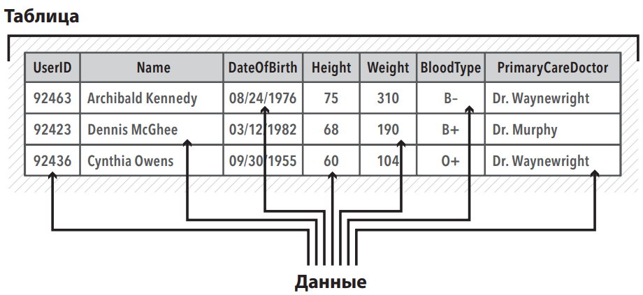
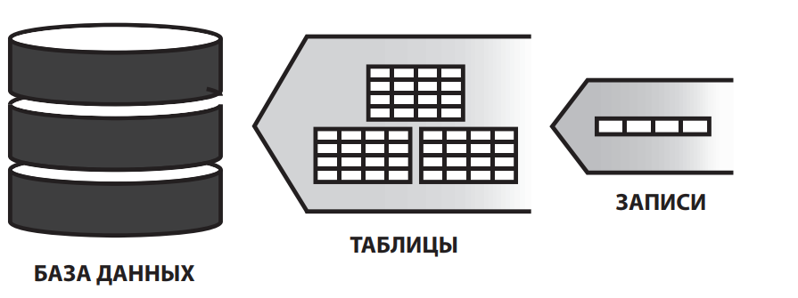
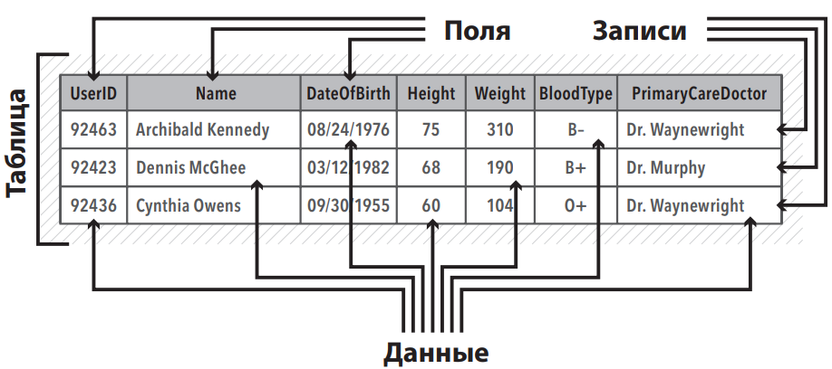
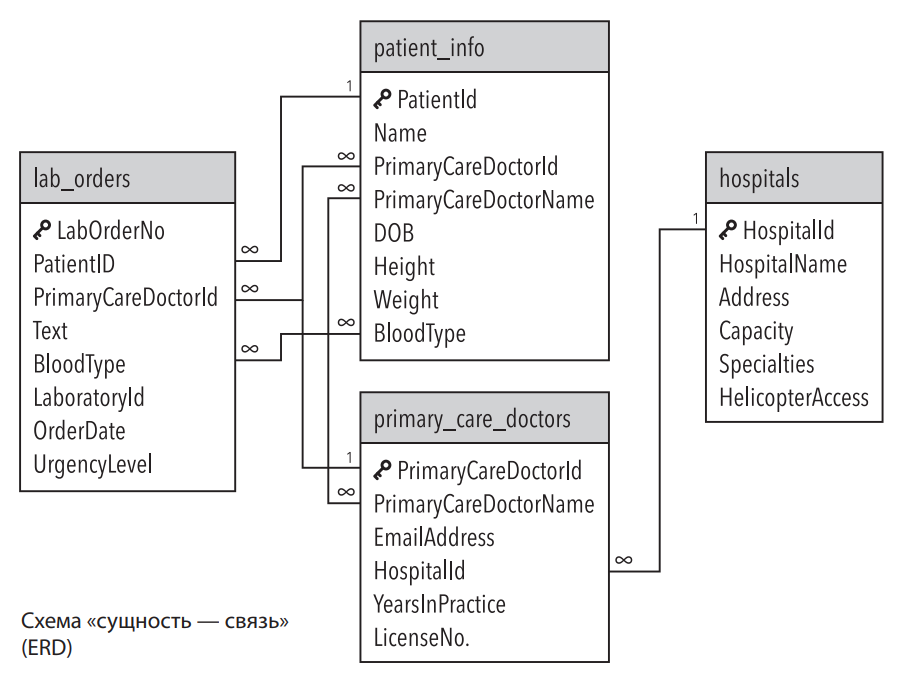
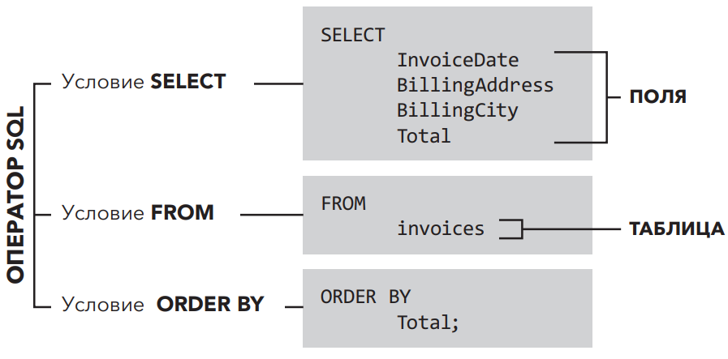

# Структура базы данных #

## Основная терминология ## 

_«данные»_ обычно относится к информации уже записанной или той, которую можно записать
_Таблица_ — один из самых простых инструментов, используемых для записи и визуализации данных



Все базы данных содержат _метаданные_, то есть данные, описывающие структуру и форматирование самих данных,
часто называемые «данными о данных». Например, поле DateOfBirth (дата рождения) может содержать метаданные, которые
преобразовывают информацию к формату мм/дд/гггг. Метаданные, содержащиеся в поле Height
(рост), могут ограничивать длину данных двумя знаками, если рост измеряется в дюймах.

Термин «база данных» можно определить как совокупность данных, упорядоченных для упрощения и скорости поиска.
Как правило, информация внутри базы данных хранится в виде набора таблиц.
Каждая таблица содержит определенные наборы данных, которые могут быть взаимосвязаны с другими данными из других таблиц
и ссылаться на них.

Роль базы данных — упростить взаимодействие, организацию и анализ связанных данных из различных источников. Данные
сохраняются во взаимосвязанных таблицах, что дает возможность манипулировать ими более гибко



База данных состоит из таблиц. Таблицы состоят из записей.

_Строки_ в таблице называются _записями_. Также их можно называть _кортежами_. Столбцы в таблице, как правило,
называются _полями_. Также их можно назвать _атрибутами_. Поля/атрибуты — это категории, используемые для определения
данных в записи (строке).

Каждая запись разбита на несколько полей, представляющих собой отдельные элементы данных, которые описывают конкретный
элемент.



## Основные элементы реляционных баз данных ## 

Реляционная модель базы данных наиболее распространенная форма проектирования баз данных.

В реляционных базах, таблицы связаны друг с другом с помощью ключевых полей являющиеся первичным ключом.
Каждая таблица в реляционной базе данных должна содержать **_первичный ключ_**. Первичный ключ — это уникальный
идентификатор записи в таблице. Первичный ключ каждой записи должен быть уникальным и не должен быть нулевым (пустым).

В реляционной базе данных таблицы часто называют «связями», так как они содержат набор записей (строк), связанных с
различными полями (столбцами).

_**Внешний ключ**_ — это поле в таблице, значение которого соответствует первичному ключу в другой таблице.
Именно совпадение различных ключевых полей в разных таблицах обеспечивает исключительно важную взаимосвязь в реляционной
базе данных. Как правило, эти связи отображаются в виде _схемы_ базы данных, также известной как _диаграмма «сущность —
связь»_ (_ERD, Entity Relationship Diagram_), которая служит своего рода эскизом для базы данных.



В данной схеме всего четыре таблицы, и таблицы связаны друг с другом посредством одного или нескольких общих полей. Поле
`PatientID` — это первичный ключ для таблицы `patient_info` и одновременно внешний ключ для таблицы `lab_orders`. Точно
так
же поле `HospitalId` — первичный ключ для таблицы `hospitals`, но это внешний ключ для таблицы `primary_care_doctors`.

Рисунок выше описывает базу данных для обработки заказов и доставки товаров клиентам. Символы 1 и ∞, которые находятся
на схеме на концах соединительных линий описывают связи между таблицами. Когда на одном конце соединительной линии
находится символ 1, а на другом — символ ∞, это означает связь между полями таблиц «один-ко-многим».
Значок ключа, расположенный рядом с полем LabOrderNo, ParentId, HospitalId, primary_care_doctor означает, что данное
поле — это первичный ключ для данной таблицы.


Таблица `order_details` из примера выше имеет два первичных ключа (обозначено значками
ключей). Можно трактовать это как _составной ключ_, то есть для определения первичного ключа используются два или более
поля. Хотя технически в примере задействовано два ключа, стоит рассматривать их как единый элемент — собственно
первичный ключ. Комбинация данных в полях, используемая для формирования составного ключа, работает как уникальный
идентификатор для любой записи в таблице.

## Типы данных ## 

При разработке базы данных с использованием SQL для каждого используемого столбца должен быть назначен определенный _тип
данных_. Типы данных могут незначительно отличаться в зависимости от используемой версии SQL. Однако, как правило,
у вас будут числовые, символьные или текстовые типы данных, дата и время, а также логические значения.

### Числовые типы данных ###

В состав _числовых_ данных входят целочисленные данные, которые служат для отображения **целых чисел**. Обычно, когда
используется целочисленный тип данных, он имеет ограничения на длину для экономии памяти.

Когда целочисленные данные не подходят и возникает необходимость в более точном числовом формате, мы можем использовать
формат чисел с _плавающей запятой_. Как и целочисленные данные, они могут быть ограничены по длине.
SQL также допускает денежные (финансовые) типы данных.

| Имя              | Размер     | Описание                                  | Диапазон                                              |
|------------------|------------|-------------------------------------------|-------------------------------------------------------|
| smallint         | 2 байта    | целое в небольшом диапазоне               | \-32768 .. +32767                                     |
| integer          | 4 байта    | типичный выбор для целых чисел            | \-2147483648 .. +2147483647                           |
| bigint           | 8 байт     | целое в большом диапазоне                 | \-9223372036854775808 .. 9223372036854775807          |
| decimal          | переменный | вещественное число с указанной точностью  | до 131072 цифр до десятичной точки и до 16383 — после |
| numeric          | переменный | вещественное число с указанной точностью  | до 131072 цифр до десятичной точки и до 16383 — после |
| real             | 4 байта    | вещественное число с переменной точностью | точность в пределах 6 десятичных цифр                 |
| double precision | 8 байт     | вещественное число с переменной точностью | точность в пределах 15 десятичных цифр                |
| smallserial      | 2 байта    | небольшое целое с автоувеличением         | 1 .. 32767                                            |
| serial           | 4 байта    | целое с автоувеличением                   | 1 .. 2147483647                                       |
| bigserial        | 8 байт     | большое целое с автоувеличением           | 1 .. 9223372036854775807                              |

#### Целочисленные типы ####

Типы `smallint`, `integer` и `bigint` хранят целые числа, то есть числа без дробной части, имеющие разные допустимые
диапазоны. Попытка сохранить значение, выходящее за рамки диапазона, приведёт к ошибке.

Чаще всего используется тип `integer`, как наиболее сбалансированный выбор ширины диапазона, размера и быстродействия.
Тип
`smallint` обычно применяется, только когда крайне важно уменьшить размер данных на диске. Тип `bigint` предназначен для
тех
случаев, когда числа не умещаются в диапазон типа `integer`.

В SQL определены только типы `integer` (или `int`), `smallint` и `bigint`. Имена типов `int2`, `int4` и `int8` выходят
за рамки
стандарта, хотя могут работать и в некоторых других СУБД.

#### Числа с фиксированной точностью ####

Тип `numeric` позволяет хранить числа с очень большим количеством цифр и выполнять вычисления точно. Он рекомендуется
для хранения денежных сумм и других величин, где важна точность. Однако арифметические операции со значениями `numeric`
выполняются гораздо медленнее, чем с целыми числами или с типами с плавающей точкой, описанными в следующем разделе.

Ниже мы используем следующие термины: масштаб значения `numeric` определяет количество десятичных цифр в дробной части,
справа от десятичной точки, а точность — общее количество значимых цифр в числе, т. е. количество цифр по обе стороны
десятичной точки. Например, число **23.5141** имеет точность **6** и масштаб **4**. Целочисленные значения можно считать
числами с масштабом **0**.

Для колонки типа `numeric` можно настроить и максимальную точность, и максимальный масштаб. Колонка типа `numeric`
объявляется следующим образом:

```
NUMERIC(точность, масштаб)
```

Точность должна быть положительной, а масштаб положительным или равным нулю. Альтернативный вариант

```
NUMERIC(точность)
```

Устанавливает масштаб 0. Форма:

```
NUMERIC
```

без указания точности и масштаба создаёт колонку, в которой можно сохранять числовые значения любой точности и масштаба
в пределах, поддерживаемых системой. В колонке этого типа входные значения не будут приводиться к какому-либо масштабу,
тогда как в колонках numeric с явно заданным масштабом значения подгоняются под этот масштаб. (Стандарт SQL утверждает,
что по умолчанию должен устанавливаться масштаб 0, т. е. значения должны приводиться к целым числам. Однако мы считаем
это не очень полезным. Если для вас важна переносимость, всегда указывайте точность и масштаб явно.)

> **Замечание:** Максимально допустимая точность, которую можно указать в объявлении типа, равна **1000**; если же
> использовать
> NUMERIC без указания точности, действуют ограничения, описанные в таблице.

Если масштаб значения, которое нужно сохранить, превышает объявленный масштаб колонки, система округлит его до заданного
количества цифр после точки. Если же после этого количество цифр слева в сумме с масштабом превысит объявленную
точность, произойдёт ошибка.

Числовые значения физически хранятся без каких-либо дополняющих нулей слева или справа. Таким образом, объявляемые
точность и масштаб колонки определяют максимальный, а не фиксированный размер хранения. (В этом смысле тип `numeric`
больше похож на тип `varchar(n)`, чем на `char(n)`.) Действительный размер хранения такого значения складывается из двух
байт для каждой группы из четырёх цифр и дополнительных трёх-восьми байт.

Помимо обычных чисел тип `numeric` позволяет сохранить специальное значение `NaN`, что означает `"not-a-number"` (не
число).
Любая операция c `NaN` выдаёт в результате тоже `NaN`. Записывая это значение в виде константы в команде **SQL**, его
нужно
заключать в апострофы, например так: `UPDATE` table `SET` `x = 'NaN'`. Регистр символов в строке `NaN` не важен.

> **Замечание:** В большинстве реализаций "не-число" (NaN) считается не равным любому другому значению (в том числе и
> самому
> NaN). Чтобы значения numeric можно было сортировать и использовать в древовидных индексах, PostgreSQL считает, что
> значения NaN равны друг другу и при этом больше любых числовых значений (не NaN).

Типы `decimal` и `numeric` равнозначны. Оба эти типа описаны в стандарте SQL.

#### Типы с плавающей точкой #### 

Типы данных `real` и `double` `precision` хранят приближённые числовые значения с переменной точностью. На практике эти
типы
обычно реализуют Стандарт IEEE 754 для двоичной арифметики с плавающей точкой (с одинарной и двойной точностью
соответственно), в той мере, в какой его поддерживают процессор, операционная система и компилятор.

Неточность здесь выражается в том, что некоторые значения, которые нельзя преобразовать во внутренний формат,
сохраняются приближённо, так что полученное значение может несколько отличаться от записанного. Управление подобными
ошибками и их распространение в процессе вычислений является предметом изучения целого раздела математики и компьютерной
науки, и здесь не рассматривается. Мы отметим только следующее:

- Если вам нужна точность при хранении и вычислениях (например, для денежных сумм), используйте вместо этого
  тип `numeric`.

- Если вы хотите выполнять с этими типами сложные вычисления, имеющие большую важность, тщательно изучите реализацию
  операций в вашей среде и особенно поведение в крайних случаях (бесконечность, антипереполнение).

- Проверка равенства двух чисел с плавающей точкой может не всегда давать ожидаемый результат.

На большинстве платформ тип `real` может сохранить значения в пределах от 1E-37 до 1E+37 с точностью не меньше 6
десятичных цифр. Тип `double precision` предлагает диапазон значений от 1E-307 до 1E+308 и точностью не меньше 15 цифр.
Попытка сохранить слишком большие или слишком маленькие значения приведёт к ошибке. Если точность вводимого числа
слишком велика, оно будет округлено. При попытке сохранить число, близкое к 0, но не представимое как отличное от 0,
произойдёт ошибка антипереполнения.

> **Замечание:** Параметр `extra_float_digits` определяет количество дополнительных значащих цифр при преобразовании
> значения с
> плавающей точкой в текст для вывода. Со значением по умолчанию (0) вывод будет одинаковым на всех платформах,
> поддерживаемых **PostgreSQL**. При его увеличении выводимое значение числа будет более точно представлять хранимое, но
> от
> этого может пострадать переносимость.

В дополнение к обычным числовым значениям типы с плавающей точкой могут содержать следующие специальные значения:

`Infinity`

`-Infinity`
NaN Они представляют особые значения, описанные в IEEE 754, соответственно: "бесконечность", "минус бесконечность" и "не
число". (Но компьютерах, где арифметика с плавающей точкой не соответствует стандарту IEEE 754, эти значения, вероятно,
не будут работать должным образом.) Записывая эти значения в виде констант в команде SQL, их нужно заключать в
апострофы, например так: UPDATE table SET x = '`Infinity`'. Регистр символов в этих строках не важен.

Замечание: Согласно IEEE754, NaN не должно считаться равным любому другому значению с плавающей точкой (в том числе и
самому NaN). Чтобы значения с плавающей точкой можно было сортировать и использовать в древовидных индексах, *
*PostgreSQL**
считает, что значения NaN равны друг другу, и при этом больше любых числовых значений (не NaN).

**PostgreSQL** также поддерживает форматы `float` и `float(p)`, оговорённые в стандарте **SQL**, для указания неточных
числовых типов. Здесь p определяет минимально допустимую точность в двоичных цифрах. **PostgreSQL** воспринимает запись
от `float(1)` до `float(24)` как выбор типа `real`, а запись от `float(25)` до `float(53)` как выбор
типа `double precision`. Значения `p` вне допустимого диапазона вызывают ошибку. Если `float` указывается без точности,
подразумевается тип `double precision.`

> **Замечание: Предположение, что типы `real` и `double precision` имеют в мантиссе 24 и 53 бита соответственно,
> справедливо для
> всех реализаций плавающей точки по стандарту IEEE. На платформах, не поддерживающих IEEE, размер мантиссы может
> несколько отличаться, но для простоты диапазоны p везде считаются одинаковыми.

#### Последовательные типы ####

Типы данных `smallserial`, `serial` и `bigserial` не являются настоящими типами, а представляют собой просто удобное
средство
для создания колонок с уникальными идентификаторами (подобное свойству `AUTO_INCREMENT` в некоторых СУБД). В текущей
реализации запись:

```postgresql
CREATE TABLE имя_таблицы
(
    имя_колонки SERIAL
);
```

равнозначна следующим командам:

```postgresql
CREATE SEQUENCE имя_таблицы_имя_колонки_seq;
CREATE TABLE имя_таблицы
(
    имя_колонки INTEGER NOT NULL DEFAULT nextval('имя_таблицы_имя_колонки_seq')
);
ALTER SEQUENCE имя_таблицы_имя_колонки_seq OWNED BY имя_таблицы.имя_колонки;
```

То есть при определении такого типа создаётся целочисленная колонка со значением по умолчанию, извлекаемым из генератора
последовательности. Чтобы в колонку нельзя было вставить `NULL`, в её определение добавляется ограничение `NOT NULL`. (
Во
многих случаях также имеет смысл добавить для этой колонки ограничения `UNIQUE` или `PRIMARY KEY` для защиты от
ошибочного
добавления дублирующихся значений, но автоматически это не происходит.) Последняя команда определяет, что
последовательность "принадлежит" колонке, так что она будет удалена при удалении колонки или таблицы.

> **Замечание:** Так как типы `smallserial`, serial и `bigserial` реализованы через последовательности, в числовом ряду
> значений колонки могут образовываться пропуски (или "дыры"), даже если никакие строки не удалялись. Значение,
> выделенное из последовательности, считается "задействованным", даже если строку с этим значением не удалось вставить
> в таблицу. Это может произойти, например, при откате транзакции, добавляющей данные. См. описание nextval()

Чтобы вставить в колонку `serial` следующее значение последовательности, ей нужно присвоить значение по умолчанию. Это
можно сделать, либо исключив её из списка колонок в операторе `INSERT`, либо с помощью ключевого слова `DEFAULT`.

Имена типов `serial` и `serial4` равнозначны: они создают колонки `integer`. Так же являются синонимами
имена `bigserial` и
`serial8`, но они создают колонки `bigint`. Тип `bigserial` следует использовать, если за всё время жизни таблицы
планируется
использовать больше чем 231 значений. И наконец, синонимами являются имена типов `smallserial` и `serial2`, но они
создают
колонку `smallint`.

Последовательность, созданная для колонки `serial`, автоматически удаляется при удалении связанной колонки.
Последовательность можно удалить и отдельно от колонки, но при этом также будет удалено определение значения по
умолчанию.

### Денежные типы ###

Тип `money` хранит денежную сумму с фиксированной дробной частью. Точность дробной части определяется на
уровне базы данных параметром `lc_monetary`. Для диапазона, показанного в таблице, предполагается, что число содержит
два
знака после запятой. Входные данные могут быть записаны по-разному, в том числе в виде целых и дробных чисел, а также в
виде строки в денежном формате, например '$1,000.00'. Выводятся эти значения обычно в денежном формате, зависящем от
региональных стандартов.

| Имя   | Размер | Описание       | Диапазон                                        |
|-------|--------|----------------|-------------------------------------------------|
| money | 8 байт | денежная сумма | \-92233720368547758.08 .. +92233720368547758.07 |

Так как выводимые значения этого типа зависят от региональных стандартов, попытка загрузить данные типа `money` в базу
данных с другим параметром `lc_monetary` может быть неудачной. Во избежание подобных проблем, прежде чем восстанавливать
копию в новую базу данных, убедитесь в том, что параметр `lc_monetary` в этой базе данных имеет то же значение, что и в
исходной.

Значения типов `numeric`, `int` и `bigint` можно привести к типу `money`. Преобразования типов `real`
и `double precision` так же
возможны через тип `numeric`, например:

```postgresql
SELECT '12.34'::float8::numeric::money;
```

Однако использовать числа с плавающей точкой для денежных сумм не рекомендуется из-за возможных ошибок округления.

Значение `money` можно привести к типу `numeric` без потери точности. Преобразование в другие типы может быть неточным и
также должно выполняться в два этапа:

```postgresql
SELECT '52093.89'::money::numeric::float8;
```

При делении значения типа money на другое значение money получается результат типа `double precision` (т. е. обычное
число, не денежная сумма); денежные единицы при делении сокращаются.

### Символьные, или текстовые, типы данных ###

_Символьные_, или _текстовые_, типы данных (еще их называют «строковые») могут хранить строки символов как
фиксированной,
так и переменной длины. Многие базы данных содержат текстовые поля, позволяющие хранить гораздо более длинные строки
текста. Некоторые структуры баз данных позволяют каталогизировать многостраничные тексты или даже целые книги.

| Имя                                  | Описание                                          |
|--------------------------------------|---------------------------------------------------|
| character varying(_n_), varchar(_n_) | строка ограниченной переменной длины              |
| character(_n_), char(_n_)            | строка фиксированной длины, дополненная пробелами |
| text                                 | строка неограниченной переменной длины            |

**SQL** определяет два основных символьных типа: `character varying(n)` и `character(n)`, где `n` — положительное число.
Оба эти типа могут хранить текстовые строки длиной до n символов (не байт). Попытка сохранить в колонке такого типа
более длинную строку приведёт к ошибке, если только все лишние символы не являются пробелами (тогда они будут усечены до
максимально допустимой длины). (Это несколько странное исключение продиктовано стандартом **SQL**.) Если длина
сохраняемой строки оказывается меньше объявленной, значения типа `character` будут дополниться пробелами; а тип
`character varying` просто сохранит короткую строку.

При попытке явно привести значение к типу `character varying(n)` или `character(n)`, часть строки, выходящая за границу
в `n` символов, удаляется, не вызывая ошибки. (Это также продиктовано стандартом SQL.)

Записи `varchar(n)` и `char(n)` являются синонимами `character varying(n)` и `character(n)`, соответственно.
Записи `character` без указания длины соответствует character(1). Если же длина не указывается для character varying,
этот тип будет принимать строки любого размера. Это поведение является расширением PostgreSQL.

Помимо этого, **PostgreSQL** предлагает тип `text`, в котором можно хранить строки произвольной длины. Хотя тип `text`
не описан
в стандарте **SQL**, его поддерживают и некоторые другие СУБД SQL.

Значения типа `character` физически дополняются пробелами до `n` символов и хранятся, а затем отображаются в таком виде.
Однако при сравнении двух значений типа `character` дополняющие пробелы считаются незначащими и игнорируются. С
правилами
сортировки, где пробельные символы являются значащими, это поведение может приводить к неожиданным результатам, например
`SELECT 'a '::CHAR(2) collate "C" < 'a\n'::CHAR(2)` вернёт `true` (условие будет истинным). При преобразовании значения
`character` к другому символьному типу дополняющие пробелы отбрасываются. Заметьте, что эти пробелы несут смысловую
нагрузку в типах `character varying` и `text`, а также для проверок по шаблонам `LIKE` и регулярным выражениям.

Для хранения короткой строки (до 126 байт) требуется дополнительный 1 байт плюс размер самой строки, включая дополняющие
пробелы для типа `character`. Для строк длиннее требуется не 1, а 4 дополнительных байта. Система может автоматически
сжимать длинные строки, так что физический размер на диске может быть меньше. Очень длинные текстовые строки переносятся
в отдельные таблицы, чтобы они не замедляли работу с другими колонками. В любом случае максимально возможный размер
строки составляет около 1 ГБ. (Допустимое значение n в объявлении типа данных меньше этого числа. Это объясняется тем,
что в зависимости от кодировки каждый символ может занимать несколько байт. Если вы желаете сохранять строки без
определённого предела длины, используйте типы `text` или `character varying` без указания длины, а не задавайте
какое-либо
большое максимальное значение.)

> **Подсказка:** По быстродействию эти три типа практически не отличаются друг от друга, не считая большего размера
> хранения для типа с дополняющими пробелами и нескольких машинных операций для проверки длины при сохранении строк в
> колонке с ограниченной длиной. Хотя в некоторых СУБД тип character(n) работает быстрее других, в PostgreSQL это не
> так; на деле character(n) обычно оказывается медленнее остальных типов из-за большего размера данных. В большинстве
> случаев вместо него лучше применять text или character varying.

#### Использование символьных типов #####

```postgresql
CREATE TABLE test1
(
    a character(4)
);
INSERT INTO test1
VALUES ('ok');
SELECT a, char_length(a)
FROM test1; -- (1)
```

| a   | char_length |
|-----|-------------|
| ok  | 2           |

```postgresql
CREATE TABLE test2
(
    b varchar(5)
);
INSERT INTO test2
VALUES ('ok');
INSERT INTO test2
VALUES ('good      ');
INSERT INTO test2
VALUES ('too long');
```

ОШИБКА:  значение не умещается в тип character varying(5)

```postgresql
INSERT INTO test2
VALUES ('too long'::varchar(5)); -- явное усечение
SELECT b, char_length(b)
FROM test2;
```

| b     | char_length |
|-------|-------------|
| ok    | 2           |
| good  | 5           |
| too l | 5           |

В **PostgreSQL** есть ещё два символьных типа фиксированной длины, приведённые в таблице. Тип `name` создан только для
хранения идентификаторов во внутренних системных таблицах и не предназначен для обычного применения пользователями. В
настоящее время его длина составляет 64 байта (63 ASCII-символа плюс конечный знак), но в исходном коде C она задаётся
константой `NAMEDATALEN`. Эта константа определяется во время компиляции (и её можно менять в особых случаях), а кроме
того, максимальная длина по умолчанию может быть увеличена в следующих версиях. Тип "char" (обратите внимание на
кавычки) отличается от char(1) тем, что он фактически хранится в одном байте. Он используется во внутренних системных
таблицах для простых перечислений.

| Имя    | Размер   | Описание                         |
|--------|----------|----------------------------------|
| "char" | 1 байт   | внутренний однобайтный тип       |
| name   | 64 байта | внутренний тип для имён объектов |

### Дата и время ### 

_Дата и время_ — эти данные важны во многих случаях. SQL предлагает пользователям различные форматы даты и времени:
`YYYY-MM-DD` (`ГГГГ-ММ-ДД`), `YYYY-MM-DD HH:MI:SS` (`ГГГГ-ММ-ДД ЧЧ:МИ:СС`), `YY-MM-DD` (`ГГ-ММДД`). Вы также можете
отформатировать столбец так, чтобы он содержал только год, в четырех- или двухзначном формате. В SQL форматы
даты/времени содержат встроенные числовые значения, позволяющие базе данных обрабатывать запросы, где в качестве условия
задан интервал времени. Все даты считаются по Григорианскому календарю, даже для времени до его введения.

**Типы даты/времени**

| Имя                                       | Размер  | Описание                              | Наименьшее значение | Наибольшее значение | Точность                 |
|-------------------------------------------|---------|---------------------------------------|---------------------|---------------------|--------------------------|
| timestamp [ (_p_) ] [ without time zone ] | 8 байт  | дата и время (без часового пояса)     | 4713 до н. э.       | 294276 н. э.        | 1 микросекунда / 14 цифр |
| timestamp [ (_p_) ] with time zone        | 8 байт  | дата и время (с часовым поясом)       | 4713 до н. э.       | 294276 н. э.        | 1 микросекунда / 14 цифр |
| date                                      | 4 байта | дата (без времени суток)              | 4713 до н. э.       | 5874897 н. э.       | 1 день                   |
| time [ (_p_) ] [ without time zone ]      | 8 байт  | время суток (без даты)                | 00:00:00            | 24:00:00            | 1 микросекунда / 14 цифр |
| time [ (_p_) ] with time zone             | 12 байт | только время суток (с часовым поясом) | 00:00:00+1459       | 24:00:00-1459       | 1 микросекунда / 14 цифр |
| interval [ _поля_ ] [ (_p_) ]             | 16 байт | временной интервал                    | \-178000000 лет     | 178000000 лет       | 1 микросекунда / 14 цифр |

> **Замечание:** Стандарт SQL требует, чтобы тип timestamp подразумевал timestamp without time zone (время без часового
> пояса), и PostgreSQL следует этому. Для краткости timestamp with time zone можно записать как timestamptz; это
> расширение PostgreSQL.

Типы `time`, `timestamp` и `interval` принимают необязательное значение точности p, определяющее, сколько знаков после
запятой
должно сохраняться в секундах. По умолчанию точность не ограничивается. Для типов `timestamp` и `interval` p может
принимать
значения от 0 до 6.

> **Замечание: Когда значения timestamp хранятся в восьмибайтных целых (сейчас по умолчанию это так), на всём интервале
> значений обеспечивается точность в микросекундах. Если же значения этого типа сохраняются в числах двойной точности с
> плавающей точкой (устаревший вариант компиляции), фактический предел точности может быть меньше 6. Значения timestamp
> сохраняются в секундах до или после полуночи 1 января 2000 г. Когда при этом используются числа с плавающей точкой,
> микросекундная точность достигается для дат в пределах нескольких лет от этой даты, а при удалении от неё точность
> теряется. Однако заметьте, что даты в числах с плавающей точкой позволяют представить больший диапазон timestamp, чем
> было показано выше: от 4713 до н. э. до 5874897 н. э.
>
> В зависимости от того же варианта компиляции, типы time и interval могут сохраняться в виде чисел с плавающей точкой
> или
> в восьмибайтных целых. В случае с плавающей точкой при больших значениях interval точность уменьшается.

Для типа time p может принимать значения от 0 до 6 при хранении типа в восьмибайтном целом и от 0 до 10 при хранении в
числе с плавающей точкой.

Тип interval дополнительно позволяет ограничить набор сохраняемых полей следующими фразами:

```
YEAR
MONTH
DAY
HOUR
MINUTE
SECOND
YEAR TO MONTH
DAY TO HOUR
DAY TO MINUTE
DAY TO SECOND
HOUR TO MINUTE
HOUR TO SECOND
MINUTE TO SECOND
```

Заметьте, что если указаны и поля, и точность p, указание полей должно включать SECOND, так как точность применима
только к секундам.

Тип time with time zone определён стандартом SQL, но в его определении описаны свойства сомнительной ценности. В
большинстве случае сочетание типов date, time, timestamp without time zone и timestamp with time zone удовлетворяет все
потребности в функционале дат/времени, возникающие в приложениях.

Типы abstime и reltime имеют меньшую точность и предназначены для внутреннего использования. Эти типы не рекомендуется
использоваться в обычных приложениях; их может не быть в будущих версиях.

#### Специальные значения даты/времени ####

PostgreSQL для удобства поддерживает несколько специальных значений даты/времени.
Значения infinity и -infinity имеют особое представление в системе и они отображаются в том же виде, тогда как другие
варианты при чтении преобразуются в значения даты/времени. (В частности, now и подобные строки преобразуются в
актуальные значения времени в момент чтения.) Чтобы использовать эти значения в качестве констант в командах SQL, их
нужно заключать в апострофы.

| Вводимая строка | Допустимые типы       | Описание                                              |
|-----------------|-----------------------|-------------------------------------------------------|
| epoch           | date, timestamp       | 1970-01-01 00:00:00+00 (точка отсчёта времени в Unix) |
| infinity        | date, timestamp       | время после максимальной допустимой даты              |
| \-infinity      | date, timestamp       | время до минимальной допустимой даты                  |
| now             | date, time, timestamp | время начала текущей транзакции                       |
| today           | date, timestamp       | время начала текущих суток                            |
| tomorrow        | date, timestamp       | время начала следующих суток                          |
| yesterday       | date, timestamp       | время начала предыдущих суток                         |
| allballs        | time                  | 00:00:00.00 UTC                                       |

### Логический тип данных ###

_Логические значения_ — это данные, принимающие значения True (Правда) или False (Ложь) в PostgreSQL есть и третье
состояние, "unknown", которое представляется SQL-значением NULL..

В разных версиях SQL — разные списки распознаваемых типов данных. Некоторые версии SQL, такие, как SQL Server и MySQL
не дают пользователю возможности присвоить данным тип Boolean. Вместо этого они предоставляют тип данных Bit, который
может быть легко преобразован в логический формат.

Состояние "true" может задаваться следующими значениями:

TRUE 't' 'true' 'y' 'yes' 'on' '1'

Для состояния "false" можно использовать следующие варианты:
FALSE 'f' 'false' 'n' 'no' 'off' '0'

## Системы управления реляционными базами данных ##

SQL применяется в целом ряде программных пакетов, известных как реляционные системы управления базами данных (РСУБД).
Эти системы упрощают применение SQL, когда пользователь дает команды и задает вопросы базе данных.
Наиболее распространенные СУБД — это PostgreSQL, Oracle Database, Microsoft SQL Server, MySQL, IBM Db2 и SQLite.

Тот факт, что мы сообщаем РСУБД, какую информацию нам предоставлять, определяет SQL как декларативный язык
программирования. Это отличает его от таких языков программирования, как C++, Java и т. д. Они являются более
процедурными, так как с их помощью программа создается от начала до конца (распределяется память, в том числе для
существующих справочных файлов, и т. д.). В случае SQL все распределение памяти и другие действия выполняются РСУБД.

## Оператор SELECT ##

`SELECT` — самая распространенная команда SQL.
SQL-запрос обычно состоит из оператора SELECT в сочетании с другими операторами SQL и ссылок на данные, участвующие в
запросе. Как и в случае с другими языками программирования, правильная последовательность и выбор операторов SQL важны
для создания запроса, который будет правильно интерпретирован браузером SQL. Эта строго заданная структура называется
_синтаксисом_ запроса.

Синтаксис запроса может несколько отличатся в различных реализациях РСУБД.
**SQL Server**

```tsql
SELECT TOP 10 *
FROM products;
```

```mysql
SELECT *
FROM products
LIMIT 10;
```

Это два очень простых запроса, которые по сути делают одно и то же (возвращают первые десять записей из таблицы
products), но сформулированы они немного по-разному. Единственное различие между этими двумя реализациями SQL
заключается в том, каким образом мы указываем браузеру SQL ограничить наши результаты десятью первыми записями.
В остальном запросы одинаковы. Различия между РСУБД обычно весьма незначительны. Если выражать в процентах, то эти
различия составляют менее 10%. Простые декларативные принципы SQL работают в большинстве РСУБД.

### Запросы, операторы, условия и ключевые слова ###

SELECT — это специальное ключевое слово в SQL, также его называют оператором SELECT, условием SELECT или запросом
SELECT.
_Запрос_ — это набор команд, который возвращает информацию из базы данных в виде записей. Запрос может состоять из
нескольких операторов SQL. Оператор SQL — это выполняемый РСУБД любой допустимый фрагмент кода.
Условие — это часть запроса, содержащая по крайней мере одно ключевое слово и соответствующую информацию,
которая будет использоваться вместе с этим ключевым словом



Оператор SQL может состоять из множества условий, каждое из которых содержит по крайней мере одно ключевое слово, а
также ссылки на поля и таблицы.

Общая процедура выполнения SELECT следующая:

1. Выполняются все запросы в списке WITH. По сути они формируют временные таблицы, к которым затем можно обращаться в
   списке FROM. Запрос в WITH выполняется только один раз, даже если он фигурирует в списке FROM неоднократно. (См.
   Предложение WITH ниже.)
2. Вычисляются все элементы в списке FROM. (Каждый элемент в списке FROM представляет собой реальную или виртуальную
   таблицу.) Если список FROM содержит несколько элементов, они объединяются перекрёстным соединением. (См. Предложение
   FROM ниже.)
3. Если указано предложение WHERE, все строки, не удовлетворяющие условию, исключаются из результата. (См. Предложение
   WHERE.)
4. Если присутствует указание GROUP BY, либо в запросе вызываются агрегатные функции, вывод разделяется по группам
   строк, соответствующим одному или нескольким значениям, а затем вычисляются результаты агрегатных функций. Если
   добавлено предложение HAVING, оно исключает группы, не удовлетворяющие заданному условию. (См. Предложение GROUP BY и
   Предложение HAVING ниже.)
5. Вычисляются фактические выходные строки по заданным в SELECT выражениям для каждой выбранной строки или группы
   строк. (См. Список SELECT ниже.)
6. SELECT DISTINCT исключает из результата повторяющиеся строки. SELECT DISTINCT ON исключает строки, совпадающие по
   всем указанным выражениям. SELECT ALL (по умолчанию) возвращает все строки результата, включая дубликаты. (См.
   Предложение DISTINCT ниже.)
7. Операторы UNION, INTERSECT и EXCEPT объединяют вывод нескольких операторов SELECT в один результирующий набор.
   Оператор UNION возвращает все строки, представленные в одном, либо обоих наборах результатов. Оператор INTERSECT
   возвращает все строки, представленные строго в обоих наборах. Оператор EXCEPT возвращает все строки, представленные в
   первом наборе, но не во втором. Во всех трёх случаях повторяющиеся строки исключаются из результата, если явно не
   указано ALL. Чтобы явно обозначить, что выдаваться должны только неповторяющиеся строки, можно добавить избыточное
   слово DISTINCT. Заметьте, что в данном контексте по умолчанию подразумевается DISTINCT, хотя в самом SELECT по
   умолчанию подразумевается ALL. (См. Предложение UNION+, Предложение INTERSECT и Предложение EXCEPT.)
8. Если присутствует предложение ORDER BY, возвращаемые строки сортируются в указанном порядке. В отсутствие ORDER BY
   строки возвращаются в том порядке, в каком системе будет проще их выдать. (См. Предложение ORDER BY.)
9. Если указано предложение LIMIT (или FETCH FIRST), либо OFFSET, оператор SELECT возвращает только подмножество строк
   результата. (См. Предложение LIMIT.)
10. Если указано FOR UPDATE, FOR NO KEY UPDATE, FOR SHARE или FOR KEY SHARE, оператор SELECT блокирует выбранные строки,
    защищая их от одновременных изменений. (См. Предложение блокировки ниже.)