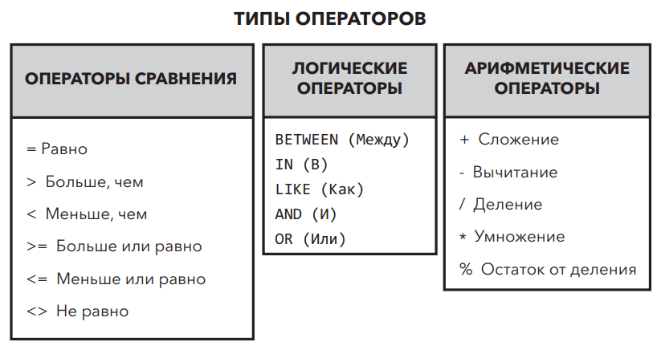

# Преобразование данных в информацию. #

Как, используя основной оператор `SELECT`, получить любой набор полей из таблицы базы данных и при необходимости
упорядочить их. в SQL существуют инструменты, которые не только позволяют сузить _набор результатов_ (то есть результаты
запроса) до очень конкретных данных, но также упорядочить и отфильтровать данные в зависимости от заданных
пользователем условий.

## Операторы сравнения, логические и арифметические операторы ##

Операторы — это специальные ключевые слова в **SQL**, которые мы используем вместе с условиями для сравнения значений
полей,
выбора подмножеств полей или выполнения арифметических операций.* В отличие от уже изученных нами ключевых слов, таких
как `SELECT`, операторы не могут существовать как самостоятельные условия **SQL**, их следует использовать с другими
условиями, такими как `SELECT` и `WHERE`.



Для создания более сложных запросов операторы разных типов можно комбинировать. Это позволяет получать данные в
зависимости от определенного диапазона или создавать уникальные условия.

Пример как арифметические операторы используются вместе с условием `SELECT` для увеличения значения поля `Total` из
таблицы `invoices` базы данных [sTunes](../db/sTunes.db). Арифметические операции полезны, когда необходимо считать
налоги, надбавки и др.

```sqlite
/*
CREATED BY: O.SUROVTSEV
CREATED ON: 01/10/2023
*/
SELECT Total      AS [Original Amount],
       Total + 10 AS [Addition Operator],
       Total - 10 AS [Subtraction Operator],
       Total / 10 AS [Division Operator],
       Total * 10 AS [Multiplication Operator],
       Total % 10 AS [Modulo Operator]
FROM invoices
ORDER BY Total DESC 
```

```markdown
### Практические задания ### 

+ Используя приведенный выше пример запроса, отобразите поле Total из таблицы invoices с добавленным налогом в размере
  15%.
```

## Фильтрация данных (WHERE) ##

Помимо условия `SELECT` операторы чаще всего используются в условии `WHERE`. С помощью `WHERE` мы можем добавлять к
нашим
запросам определенные условия, например ограничивать результаты наших запросов в соответствии с необходимыми задачами.
Некоторые распространенные типы данных, которые мы можем фильтровать, содержат числа, текст и даты. Для фильтрации
данных мы будем использовать `WHERE` вместе с операторами.

Например: Если бы нам понадобилось узнать количество клиентов, которые приобрели всего две песни по $0,99, мы бы
отобразили в таблице invoices запись на общую сумму $1,98 — за две песни.

```sqlite
SELECT InvoiceDate,
       BillingAddress,
       BillingCity,
       Total
FROM invoices
WHERE Total = 1.98
ORDER BY InvoiceDate
```

⚠️ Условие `WHERE` всегда следует после условия `FROM`, но всегда находится перед `ORDER BY`. В приведенном выше примере
условие `WHERE` добавлено для возврата всех счетов на сумму $1,98. Знак = — это оператор сравнения.

```markdown
### Практические задания ###

Используя операторы сравнения, напишите следующие запросы:

+ запрос, возвращающий все счета, превышающие значение $1,98;
+ запрос, возвращающий все счета, которые больше или равны $1,98;
+ запрос, возвращающий все счета, кроме $1,98.
```

Другой полезный вид операторов — логические. Используя логические операторы, вы можете создавать более сложные и
конкретные запросы, которые трудно выполнить с помощью операторов сравнения. Предположим, что вас попросили узнать,
какое количество счетов имеется в определенном диапазоне, например от $1,98 до $5.

В данном случае целесообразно использовать оператор `BETWEEN`. Оператор `BETWEEN` задает диапазон для проверки условия.
Для определения необходимого диапазона значений вместе с оператором `BETWEEN` используется оператор `AND`. Рассмотрим
следующий запрос, который возвращает счета, находящиеся в диапазоне от $1,98 до $5,00.

```sqlite
SELECT InvoiceDate,
       BillingAddress,
       BillingCity,
       Total
FROM invoices
WHERE Total BETWEEN 1.98 AND 5.00
ORDER BY InvoiceDate
```

Итоговые суммы счетов находятся в диапазоне от $1,98 до $5. Оператор `BETWEEN` включает в диапазон и параметры, которые
вы ему зададите. Другими словами, здесь он будет включать любые значения между 1,98 и 5,00 и равные этим значениям.
Для достижения того же результата, используя условие `WHERE` и операторы сравнения, вы можете написать следующее:
**Total >= 1.98 AND Total <= 5.00**. Однако в данном случае гораздо проще использовать оператор `BETWEEN`.

```markdown
### Практические задания ###

+ Используя предыдущий запрос, выполните сортировку по полю Total. Выясните, какая сумма счета в этом наборе данных
  максимальная.
```

Еще один очень важный оператор SQL — оператор `IN`. Он позволяет определить, совпадает ли значение в условии `WHERE` с
какими-то значениями в списке. В предыдущем примере оператор `BETWEEN` возвращал каждое значение в нашей таблице
invoices, находящееся в диапазоне от 1,98 до 5,00. Оператор `IN` позволяет нам находить указанные значения в наборе
данных. Значения разделены запятой и заключены в круглые скобки. Следующий запрос возвращает только суммы счетов-фактур,
равные $1,98 или $3,96

```sqlite
SELECT InvoiceDate,
       BillingAddress,
       BillingCity,
       Total
FROM invoices
WHERE Total in (1.98, 3.96)
ORDER BY InvoiceDate
```

С помощью оператора = мы можем добавить только одно значение. С помощью оператора IN мы можем добавить сколько угодно
значений, разделенных запятыми. Также мы можем использовать оператор IN с текстом.

## Фильтрация строк ##

Мы также можем использовать операторы для возврата определенного текста подобно тому, как мы делали с числами.
Рассмотрим пример с использованием операторов сравнения. Ответим на следующий вопрос: сколько счетов было выставлено в
городе Тусон (Tucson)? Для этого необходимо структурировать наш оператор `SELECT`. Следующий запрос возвращает все
счета,
выставленные в городе Тусон:

```sqlite
SELECT InvoiceDate,
       BillingAddress,
       BillingCity,
       Total
FROM invoices
WHERE BillingCity = 'Tucson'
ORDER BY Total
```

В результате получено только семь счетов для города Тусон. При использовании текста в качестве критерия в
условии `WHERE` указанные текстовые значения должны быть заключены в одинарные кавычки (BillingCity = 'Tucson').

В предыдущем примере мы использовали символ `=`, так как требовалось найти только одно значение. Если бы стояла задача
получить данные для нескольких городов, мы могли бы использовать оператор `IN` аналогично тому, как мы использовали его
для получения числовых значений.

```sqlite
SELECT InvoiceDate,
       BillingAddress,
       BillingCity,
       Total
FROM invoices
WHERE BillingCity IN ('Tucson', 'Paris', 'London')
ORDER BY Total
```

## Использование оператора LIKE для поиска подстановочных знаков ##

SQL также позволяет искать фрагменты текстовой строки с помощью оператора LIKE. Оператор LIKE использует подстановочные
знаки, представленные символом % (символ процента). То, что следует за знаком =, это единственное значение, которое вы
увидите в своем наборе результатов. С помощью оператора LIKE и подстановочного знака вы можете определить варианты
ввода.

Подстановочные знаки всегда заключаются в одинарные кавычки. Не заключенный в кавычки символ % — это просто
арифметический оператор (показан ранее в этой главе в таблице операторов). Текстовый поиск не чувствителен к регистру.
При использовании в запросе строчной или заглавной буквы результаты будут одинаковы.
С помощью подстановочного знака можно задать любое количество символов любого типа. Как показано в примере ниже, запрос
ищет любые счета, выставленные в городах на букву T. В результат теперь попали Торонто и Тусон.

```sqlite
SELECT InvoiceDate,
       BillingAddress,
       BillingCity,
       Total
FROM invoices
WHERE BillingCity LIKE 'T%'
ORDER BY Total
```

Добавление еще одного символа % перед буквой T изменит условие поиска на поиск счета, выставленного в городе, название
которого содержит букву T.

```sqlite
SELECT InvoiceDate,
       BillingAddress,
       BillingCity,
       Total
FROM invoices
WHERE BillingCity LIKE '%T%'
ORDER BY Total
```

## Фильтрация записей по дате ##

Используя все знания как о числах, так и о тексте, вы сможете теперь выполнить поиск счета, выставленного в определенную
дату. Рассмотрим следующий пример:

```sqlite
SELECT InvoiceDate,
       BillingAddress,
       BillingCity,
       Total
FROM invoices
WHERE InvoiceDate = '2009-01-03 00:00:00'
ORDER BY Total
```

### Практические задания: ###

- Получите все счета, выставленные в период с 1 января 2009 г. по 31 декабря 2009 г.

```sqlite
SELECT InvoiceDate,
       BillingAddress,
       BillingCity,
       Total
FROM invoices
WHERE InvoiceDate BETWEEN ('2009-01-01 00:00:00') and ('2009-12-31 00:00:00')
ORDER BY Total
```

- Найдите 10 самых крупных счетов, полученных после 5 июля 2009 г.

```sqlite
SELECT InvoiceDate,
       BillingAddress,
       BillingCity,
       Total
FROM invoices
WHERE DATE(InvoiceDate) > '2009:06:05'
ORDER BY Total DESC
LIMIT 10 
```

## Функция DATE() ##

При работе с датами в **SQL** можно использовать ряд функций, которые помогают получать более точные результаты. Из
предыдущего примера видно, что столбец InvoiceDate таблицы invoices имеет тип данных DATETIME. Поэтому, когда мы
указывали значение даты в условие `WHERE`, мы включали время (`2009-01-03 00:00:00`). Функция `DATE()` позволяет
исключить время при указании параметров даты.

```sqlite
SELECT InvoiceDate,
       BillingAddress,
       BillingCity,
       Total
FROM invoices
WHERE DATE(InvoiceDate) = '2009-01-03'
ORDER BY Total
```

Функция `DATE()` позволяет получить результат быстрее, когда параметры времени либо отсутствуют, либо не актуальны.

## Использование операторов AND и OR с двумя отдельными полями ##

Мы также можем применить операторы `AND` и `OR` для указания параметров нескольких полей. В приведенном ниже запросе
оператор
AND используется вместе с функцией `DATE()` для поиска всех счетов, оформленных после 02.01.2010, на общую сумму менее
$3,00. Результат этого запроса должен удовлетворять одновременно обоим условиям: (`DATE (InvoiceDate)>'2010-01-02' AND
Total<3)`

```sqlite
SELECT InvoiceDate,
       BillingAddress,
       BillingCity,
       Total
FROM invoices
WHERE DATE(InvoiceDate) > '2010-01-02'
  AND Total < 3
ORDER BY Total;
```

### Практические задания ###

Найдите все счета, которые были выставлены в городе, название которого начинается с буквы P, а общая сумма превышает $2

```sqlite
SELECT InvoiceDate,
       BillingAddress,
       BillingCity,
       Total
FROM invoices
WHERE BillingCity LIKE 'P%'
  AND Total > 2; 
```

## Оператор OR ##

Оператор OR позволяет найти записи, соответствующие любому из заданных вами условий.

```sqlite
/*
выполняется поиск всех счетов, выставленных 
в городах, названия которых начинаются с буквы P или с буквы D.
*/
SELECT InvoiceDate,
       BillingAddress,
       BillingCity
FROM invoices
WHERE BillingCity LIKE 'p%'
   OR BillingCity LIKE 'd%'
ORDER BY Total;
```

## Использование круглых скобок с операторами AND и OR для указания порядка операций ##

При написании в SQL более длинных условий `WHERE`, включающих несколько логических операторов, можно определить порядок
выполнения операций аналогично правилам базовой арифметики. Возможно, вы встречали аббревиатуру _PEMDAS_ (Parentheses,
Exponents, Multiplication, Division, Addition, Subtraction — круглые скобки, экспоненты, умножение, деление, сложение,
вычитание) или похожую _BEMDAS_ (Brackets, Exponents, Multiplication, Division, Addition, Subtraction). Первая
используется в США, вторая — в странах, где сильно влияние Великобритании. Если не встречали, то не
стоит беспокоиться. Способ определения порядка операций очень простой. Но пока рассмотрим работу операторов `AND` и `OR`
.
Допустим, нам необходимо получить все счета на сумму свыше $1,98 из любых городов, названия которых начинаются с буквы P
или D. Запрос будет выглядеть следующим образом:

```sqlite
SELECT InvoiceDate,
       BillingAddress,
       BillingCity,
       Total
FROM invoices
WHERE Total > 1.98 AND BillingCity LIKE 'p%'
   OR BillingCity like 'd%'
ORDER BY Total;
```

Когда данный запрос выполняется, браузер **SQL** сначала объединяет два условия по обе стороны от оператора `AND`,
возвращая
счета, общая сумма которых превышает _$1,98,_ и названия городов, где они были выставлены, начинаются с буквы _P_. Затем
отдельно обрабатывается условие справа от оператора `OR`, как если бы оператора AND не существовало. Другими словами,
запрос сначала выполняет поиск результатов, где `Total>1.98 AND BillingCity LIKE 'p%'`. Затем выполняется поиск всех
результатов, где `BillingCity LIKE 'd%'`, а затем возвращаются результаты для обоих условий в порядке возрастания в поле
Total.

Если вышеуказанный запрос вы ввели в свой браузер **SQL**, то заметите, что получены данные, соответствующие значению
менее $1,98, но только для городов, начинающихся с буквы _D_. Это связано с тем, что порядок операций **SQL** определен
следующим образом: сначала обрабатывается оператор `AND`, а затем — оператор OR. Это не совсем так, как мы изначально
хотели, но есть простой способ обрабатывать наш запрос именно так, как мы планировали, без необходимости прибегать к
логическим операторам. В SQL порядок оператора AND соответствует порядку операции умножения, а оператора OR — операции
сложения, если не добавлены круглые скобки. При отсутствии круглых скобок оператор AND будет обрабатываться по
принципу, аналогичному арифметике: `3*2+1 равно 7`, а `3*(2+1)` равно `9`.

При добавлении круглых скобок, как показано в примере ниже, браузер **SQL** сначала выполняет поиск данных,
удовлетворяющих условиям внутри скобок: **(BillingCity LIKE 'p%' OR BillingCity LIKE 'd%')**. Затем только из этих
записей,
он ищет данные, общая сумма которых превышает **$1,98 (Total>1.98)**.

```sqlite
SELECT InvoiceDate,
       BillingAddress,
       BillingCity,
       Total
FROM invoices
WHERE Total > 1.98
  AND (BillingCity LIKE 'p%' OR BillingCity LIKE 'd%')
ORDER BY Total
```

## Практические задания ##

- Найдите все счета с общей суммой выше $3,00, выставленные в городах, название которых начинается с буквы P или D.

```sqlite
SELECT InvoiceDate,
       BillingAddress,
       BillingCity,
       Total
FROM invoices
WHERE Total > 3.00
  AND (BillingCity LIKE '%p' OR BillingCity LIKE 'd%')
ORDER BY Total;
```

## Оператор CASE ##

Оператор `CASE` позволяет создать новое временное поле в базе данных, которое станет меткой для данных на основе
заданных
пользователем условий. Чтобы лучше понять смысл оператора `CASE`, рассмотрим следующий сценарий.

## Использование в запросе оператора CASE ##

```sqlite
SELECT InvoiceDate,
       BillingAddress,
       BillingCity,
       Total
FROM invoices
ORDER BY BillingCity;
```

Теперь нам необходимо отсортировать наши результаты в зависимости от названия города, где выставлен счет, чтобы мы
могли увидеть целевые покупки в зависимости от региона.

Чтобы добавить оператор `CASE` к данному запросу, необходимо добавить его в нижнюю часть блока `SELECT` после всех
существующих полей. Начнем с ключевого слова CASE, за которым вставим ключевое слово `END`. Между этими двумя ключевыми
словами нам необходимо определить условия. Каждая проверка начинается с ключевого слова WHEN, за которым следует
условие. Наше первое условие — это **Baseline Purchase** (базовая покупка), то есть любой счет, сумма которого менее **
$2,00**,
другими словами "**TOTAL<2.00**". После логического условия в случае его выполнения необходимо указать ожидаемый
результат.
Для этой цели используем оператор THEN. Наш ожидаемый результат — покупки менее **$2,00** с меткой **Baseline
Purchase** (
базовая покупка), что и предусмотрено для нашего сценария.

Эту же последовательность можно повторить для любого
количества условий. Поэтому этот метод мы повторим для остальных категорий покупок. Ключевое слово `ELSE` всегда ставят
за
последним явным перечисленным условием. Любые записи, которые еще не определены, будут отнесены к категории, указанной в
условии `ELSE`. Оператор `CASE`

### ВНИМАНИЕ

Ключевое слово `ELSE` указывать не обязательно, но рекомендуется. В данных могут быть значения, выходящие за рамки
требуемых условий. Условие `ELSE` фиксирует эти значения, и вы можете понять, что с ними делать. Если условие
`ELSE` не добавлено, любые результаты в вашем наборе данных, выходящие за рамки требуемых условий, будут возвращены как
значение `NULL`. Последнее, что мы делаем, — создаем псевдоним, то есть новое поле в нашей базе данных. Этот псевдоним
будет расположен после оператора `END`. Создадим новое поле с именем PurchaseType.

### НАПОМИНАНИЕ

Мы создаем псевдонимы с помощью ключевого слова `AS`. Таким образом, оператор `CASE` завершается словом `END AS`, а
затем псевдонимом, который
мы выбрали для нового поля.

**Запрос будет выглядеть следующим образом:**

```sqlite
SELECT InvoiceDate,
       BillingAddress,
       BillingCity,
       Total,
       CASE
           WHEN Total < 2.00 THEN 'Baseline Purchase'
           WHEN Total BETWEEN 2.00 AND 6.99 THEN 'Low Purchase'
           WHEN Total BETWEEN 7.00 AND 15.00 THEN 'Target Purchase'
           ELSE 'Top Performers'
           END AS PurchaseType
FROM invoices
WHERE PurchaseType = 'Top Performers'
ORDER BY PurchaseType DESC;
```

```sqlite
SELECT InvoiceDate,
       BillingAddress,
       BillingCity,
       Total,
       CASE
           WHEN Country = 'USA' THEN 'Domestic Sales'
           ELSE 'Foreign Sales'
           END AS SalesType
FROM invoices
         INNER JOIN customers c on c.CustomerId = invoices.CustomerId
WHERE Total > 15
  AND SalesType like 'Domestic Sales'
```