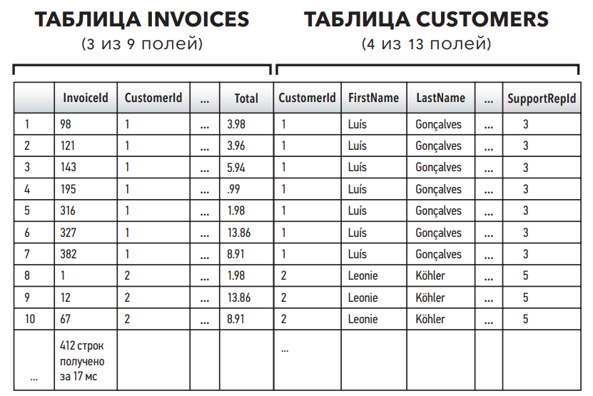
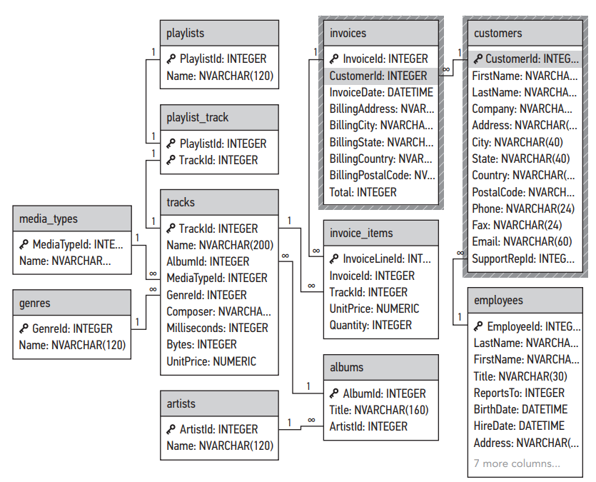
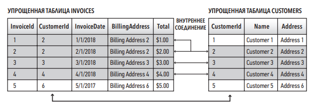
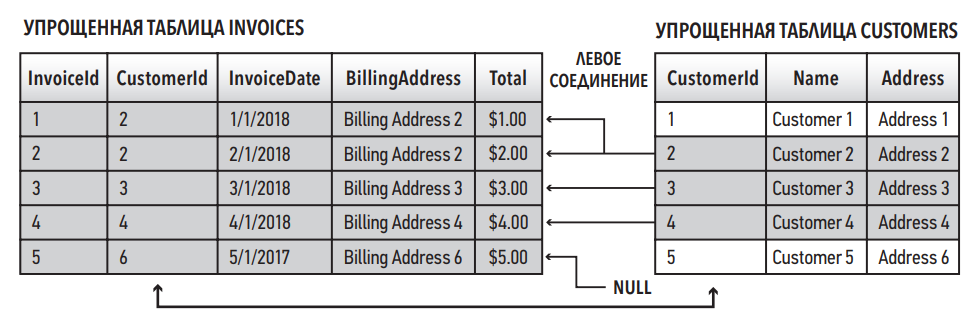
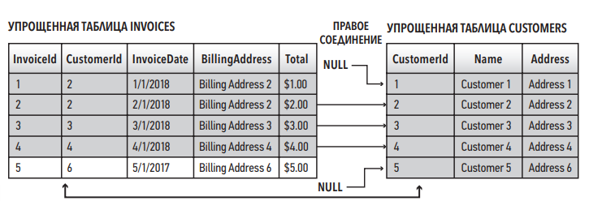
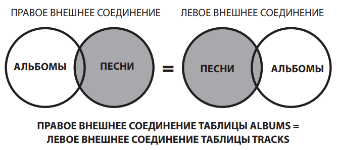

# **Что такое соединение**

Соединение (`join`) — это операция, которая объединяет поля двух или более таблиц
реляционной базы данных.

⚠️ _Каждая таблица должна содержать хотя бы одно поле, служащее первичным ключом. Первичный ключ одной таблицы, как
правило,
является внешним ключом для другой таблицы._

Рассмотрим пример использования операции соединения JOIN, объединяющей эти таблицы.

```sqlite
SELECT *
FROM invoices
         INNER JOIN customers c ON invoices.CustomerId = c.CustomerId
```

Результат:



## Соединения и структура реляционной базы данных

Теперь проанализируем, что произойдет, если объединить таблицу `invoices` с таблицей customers. Рассмотрим
поле `InvoiceId` из таблицы invoices результирующего набора данных. Мы увидим, что первые семь записей связаны с одним и
тем же `CustomerId`. Это означает, что клиенту № 1 выставили все семь счетов. Если мы проанализируем часть
результирующей таблицы customers, то увидим, что данного клиента зовут Luís Gonçalves. Один клиент связан со многими
счетами. На языке реляционной базы данных мы можем сказать, что таблица `customers` имеет связь «один-ко-многим» с
таблицей `invoices`. Клиенту с одним `CustomerId` могут выставить множество счетов (если он заказал несколько песен), но
в таблице `invoices` сохранится один и тот же номер `CustomerId`. Еще один вариант описания этой связи — схема базы
данных в виде ER-диаграммы (ER от **_Entity — Relationship_**, сущность — связь).



### Зачем в базах данных нужно иметь несколько таблиц?

Нормализация — это процесс организации данных в реляционной базе данных. Нормализация включает создание таблиц и
установку отношений между таблицами. Нормализация позволяет уменьшить размеры баз данных, так как не надо хранить
повторяющиеся поля в одной таблице. По мере увеличения размера базы данных возрастает потребность в ее нормализации. Это
целесообразно, даже если экономится всего нескольких секунд при обработке запроса. Учитывая гигантский размер некоторых
баз данных, каждая секунда имеет значение.

## **Псевдонимы соединяемых таблиц**

Из первого примера видно, что при обращении к полям соединения `JOIN` имеют особый синтаксис. Поскольку две таблицы в
любой базе данных могут содержать поля с одинаковыми именами, при создании соединений необходимо для указания
определенного поля задать имя таблицы, чтобы браузер SQL точно знал, какое поле имеется в виду. По правилам синтаксиса
необходимо сначала указать имя таблицы, а затем через точку — имя поля. Чтобы уменьшить объем текста и повысить
удобочитаемость, в соединениях часто используются псевдонимы.

```sqlite
SELECT *
FROM invoices
         INNER JOIN customers ON invoices.CustomerId = customers.CustomerId;

------------------------------------------------------------------------------------------------------------------------

SELECT *
FROM invoices AS i
         INNER JOIN customers AS c ON i.CustomerId = c.CustomerId
```

⚠️ Псевдонимы для соединений должны быть краткими и удобочитаемыми. Они, как правило, состоят из одной буквы, причем
используется первая буква соответствующей таблицы (`tablename.FieldName` будет записано как `t.FieldName`).
Когда мы используем символ *, мы не можем контролировать порядок отображения полей.

Поскольку мы работаем с двумя таблицами, содержащими отдельные поля с одинаковыми именами, в условии `SELECT` следует
использовать обозначение `tablename.FieldName`, как и в условии `ON` наших соединений, но с одним изменением: вместо
полного имени таблицы мы зададим псевдоним, состоящий из первой буквы таблицы, за которой следует точка, а затем имя
поля.

```sqlite
SELECT c.LastName,
       c.FirstName,
       i.InvoiceId,
       i.InvoiceDate,
       i.Total
FROM invoices AS i
         INNER JOIN customers c ON i.CustomerId = c.CustomerId
ORDER BY LastName
```

⚠️ Кажется странным, что мы ссылаемся на псевдонимы (в условии `SELECT`), прежде чем определим их (в условиях `FROM` и
`INNER JOIN`). Но следует помнить, что браузер SQL обрабатывает запросы не в той очередности, как их прочел бы человек.

⚠️ В большинстве случаев в условии SELECT рекомендуется указывать отдельные имена полей и избегать использования
символа *.

## Типы соединений

Существует несколько различных типов соединений.
**Что произойдет, если данные из таблиц, которые мы объединяем, не полностью совпадают?**
Для обработки несовпадений между таблицами используются разные типы соединений.

### **Внутреннее соединение (INNER JOIN)**


При использовании внутреннего соединения возвращаются только совпадающие записи. Любые несовпадающие данные из любой
таблицы игнорируются. Как показано на диаграмме Венна, включены только перекрывающиеся данные.



Как мы уже говорили ранее, поле CustomerId имеет отношение «один-ко многим» с таблицей invoices. Хотя эти данные могут
показаться несоответствующими, в нашем случае в результате вернутся четыре записи. Это происходит потому, что клиенту
Customer 2 было выставлено два отдельных счета.

Пример использования внутреннего соединения.

```sqlite
SELECT i.InvoiceId,
       c.CustomerId,
       c.FirstName,
       c.Address,
       i.InvoiceDate,
       i.BillingAddress,
       i.Total
FROM invoices AS i
         INNER JOIN customers AS c ON i.CustomerId = c.CustomerId
```

Сначала в условии SELECT перечислены поля, которые необходимо отобразить, при этом использованы псевдонимы.
Поскольку внутренние соединения возвращают только совпадающие данные, порядок перечисления таблиц не имеет значения.
Порядок будет иметь значение для других типов соединений. Внутреннее соединение — это наиболее распространенный тип
соединения. Оно используется для соединения соответствующих данных из разных таблиц реляционной базы данных.

⚠️ Слово «`INNER`» необязательно. Под всеми соединениями понимается INNER соединение, если не указано иное. Другими
словами, по умолчанию все соединения — INNER (внутренние).

### **Левое внешнее соединение (`LEFT OUTER JOIN`)**

Левое внешнее соединение LEFT OUTER JOIN соединяет все записи из левой таблицы с любыми совпадающими записями из правой
таблицы.


⚠️ Понятия «левая таблица» и «правая таблица» полностью зависят от порядка перечисления данных таблиц в соединении JOIN.
Изменение порядка перечисления приведет к другому результату.

В отличие от внутреннего соединения, которое отображает равное количество записей из каждой таблицы, в результате
использования левого внешнего соединения вернется больше записей из «левой» таблицы.



SQL-запрос для левого внешнего соединения аналогичен запросу, который мы использовали для внутреннего соединения.
Отличие только в использовании условия `LEFT OUTER JOIN`.

```sqlite
SELECT i.InvoiceId,
       c.CustomerId,
       c.FirstName,
       c.Address,
       i.InvoiceDate,
       i.BillingAddress,
       i.Total
FROM invoices AS i
         LEFT OUTER JOIN customers AS c
                         ON i.CustomerId = c.CustomerId
```

Слово «внешнее» (`OUTER`) необязательно. Использование левого соединения позволяет нам видеть несовпадения в наших
данных.

### Правое внешнее соединение (`RIGHT OUTER JOIN`)

В SQLite не поддерживается использование правого внешнего соединения, но правое внешнее соединение по-прежнему популярно
в других реализациях РСУБД.

В результате использования правого внешнего соединения `RIGHT OUTER JOIN` возвращаются все данные из правой таблицы, а
также соответствующая информация из левой таблицы. Правое соединение — зеркальное отображение левого соединения


При использовании правого соединения берутся все поля из правой таблицы (`customers`) и ее данные сопоставляются с
любыми соответствующими данными из таблицы `invoices`.



Оператор SQL, необходимый для создания правого соединения, такой же как и в двух других соединениях.

⚠️ Ключевое слово «внешнее» (`OUTER`) необязательно. Вариант `RIGHT JOIN` дает тот же результат.

```postgresql
SELECT i.InvoiceId,
       c.CustomerId,
       c.FirstName,
       c.Address,
       i.InvoiceDate,
       i.BillingAddress,
       i.Total
FROM invoices AS i
         RIGHT OUTER JOIN
     customers AS c
     ON
         i.CustomerId = c.CustomerId
```


Правые соединения используются реже, чем левые. Поскольку SQLite не распознает правое соединение, в запросе
рекомендуется изменить порядок таблиц, что приведет к тому же набору результатов.

### **Внутренние соединения для случаев соединения двух и более таблиц**

Можно соединять и более двух таблиц. Чтобы добавить дополнительные таблицы, нужно просто следовать тем же правилам, что
мы рассмотрели ранее, когда рассказывали про внутренние соединения.

Обратите внимание, что до этого момента имена двух полей, связанных друг с другом оператором ON, были идентичны. В
данном случае мы связываем два поля с разными именами, хотя из ER-диаграммы видно, что они являются связанными полями.
Почему так происходит? Данное несоответствие дает нам важный урок о структуре реляционной базы данных. Два связанных
поля необязательно должны иметь одно и то же имя.

| НЕОБХОДИМЫЕ ПОЛЯ                                                                                                                 |                     СИНТАКСИС                      |
|----------------------------------------------------------------------------------------------------------------------------------|:--------------------------------------------------:|
| Имя сотрудника, <br/>фамилия сотрудника, <br/>идентификационный номер сотрудника (данные из таблицы employees)                   |  e.FirstName, <br/>e.LastName, <br/>e.EmployeeId,  | 
| Имя клиента, <br/>фамилия клиента, <br/>идентификационный номер представителя службы поддержки (данные из таблицы customers)     | c.FirstName, <br/>c.LastName, <br/>c.SupportRepId, |  
| Идентификационный номер клиента, <br/>общая сумма покупки (данные из таблицы invoices)                                           |            i.CustomerId, <br/>i.Total,             |  
| Полученный результат необходимо сортировать по сумме счета (в порядке убывания) <br/> и ограничить результат до 10 счетов-фактур |            i.Total DESC, <br/>LIMIT 10             |  

```sqlite
SELECT e.FirstName,
       e.LastName,
       e.EmployeeId,
       c.FirstName,
       c.LastName,
       c.SupportRepId,
       i.CustomerId,
       i.Total
FROM invoices AS i
         INNER JOIN customers AS c ON i.CustomerId = c.CustomerId
         INNER JOIN employees AS e ON c.SupportRepId = e.EmployeeId
ORDER BY i.Total DESC
LIMIT 10;
```

_**Практическое задание**: Проанализируйте ER-диаграмму и выберите другую таблицу для добавления к этому запросу с
помощью другого внутреннего соединения. Определите необходимые для вывода поля и добавьте их в оператор SELECT._

```sqlite
SELECT e.FirstName,
       e.LastName,
       e.EmployeeId,
       c.FirstName,
       c.LastName,
       c.SupportRepId,
       i.CustomerId,
       i.Total,
       ii.TrackId
FROM invoices AS i
         INNER JOIN customers c ON c.CustomerId = i.CustomerId
         INNER JOIN employees e ON c.SupportRepId = e.EmployeeId
         INNER JOIN invoice_items ii on i.InvoiceId = ii.InvoiceId
ORDER BY i.Total DESC
LIMIT 10;
```

### Использование левых внешних соединений с операторами NULL, IS и NOT

Левое внешнее соединение извлекает все данные из левой таблицы и всю соответствующую информацию из правой таблицы.

```sqlite
SELECT ar.ArtistId AS [artist_id_from_artist_table],
       al.ArtistId AS [artist_id_from_album_table],
       ar.Name     AS [artist_name],
       al.Title    AS [album_title]
FROM artists AS ar
         LEFT OUTER JOIN albums AS al ON ar.ArtistId = al.ArtistId
WHERE al.ArtistId IS NULL;
```

⚠️ При работе со значениями NULL необходимо использовать операторы IS и NOT, а не оператор равенства =. Нулевые значения
указывают на недостаток данных. Оператор = сравнивает значения двух элементов. Нулевые значения не содержат значений,
поэтому их нельзя сравнивать, используя оператор =. Использование оператора = приведет к ошибке.

### Преобразование правого соединения в левое

Как мы уже говорили, правые соединения в SQLite не поддерживаются. Мы также узнали, что правые соединения — это
зеркальное отображение левых соединений. Рассмотрим диаграмму Венна. При использовании правого соединения берутся все
записи с правой стороны и объединяются со всеми соответствующими записями с левой стороны. Если вы просто поменяете
местами левую и правую таблицы, то для получения того же результата вы можете использовать левое внешнее соединение.

Следующий запрос написан с использованием правого внешнего соединения. В данном запросе любая соответствующая
информация об альбоме или названии из таблицы albums объединяется со всеми записями из таблицы tracks.

```postgresql
SELECT *
FROM albums AS al
         RIGHT OUTER JOIN tracks AS t ON t.AlbumId = al.AlbumId;
```

аналогично

```sqlite
SELECT *
FROM tracks AS t
         LEFT OUTER JOIN albums AS al ON t.AlbumId = al.AlbumId;

```



```sqlite
SELECT t.TrackId,
       t.Composer,
       t.Name,
       al.AlbumId,
       al.Title
FROM albums AS al RIGHT OUTER JOIN tracks AS t
ON t.AlbumId = al.AlbumId;
```

При выполнении предыдущего запроса возникнет следующая
ошибка: `RIGHT and FULL OUTER JOINs are not currently supported` ( Правое и полное внешние соединения в настоящее время
не поддерживаются).

Однако для решения данной проблемы мы можем просто поменять местами таблицы.

```sqlite
SELECT t.TrackId,
       t.Composer,
       t.Name,
       al.AlbumId,
       al.Title
FROM tracks AS t
         LEFT OUTER JOIN albums AS al ON t.AlbumId = al.AlbumId;
```

Главный вывод от использования левых/правых соединений: они могут «устранить неполадки» в нашей базе данных и выявить
несоответствия в данных.

Если вам нужно найти соответствующие данные и вам не критично потерять несколько записей из-за ошибок в базе данных, то
просто пользуйтесь соединением `INNER JOINT`.

_Практическое задание:
Измените приведенный выше запрос так, чтобы отображались только записи, в которых поле Composer содержит значение NULL._

```sqlite
SELECT t.TrackId,
       t.Composer,
       t.Name,
       al.AlbumId,
       al.Title
FROM tracks AS t
         LEFT OUTER JOIN albums AS al
                         ON t.AlbumId = al.AlbumId
WHERE Composer IS NULL;
```

Контрольные вопросы

1. Проанализируйте таблицу tracks. Определите, какие поля в этой таблице будут внешними ключами в другой таблице. На
   основании определенных вами внешних ключей определите, какие таблицы связаны с таблицей tracks.
2. Создайте внутреннее соединение между таблицами albums и tracks и отобразите названия альбомов и названия треков в
   едином наборе результатов.
3. Создайте третье внутреннее соединение — с таблицей genres, которую вы нашли, отвечая на вопрос 1. Включите в ваш
   набор результатов поле Name из этой таблицы.

```sqlite
SELECT a.Title,
       t.Name,
       g.Name
FROM tracks AS t
         INNER JOIN albums a ON t.AlbumId = a.AlbumId
         INNER JOIN genres g ON g.GenreId = t.GenreId;
```