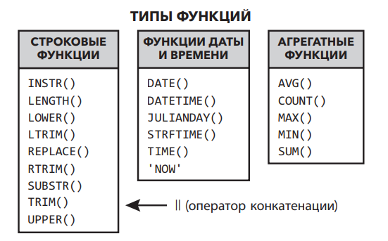
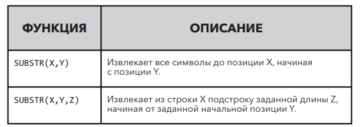
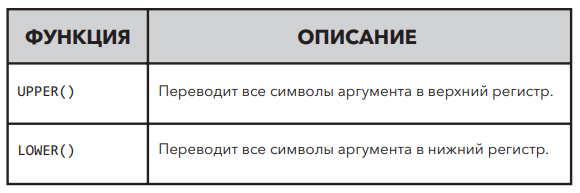
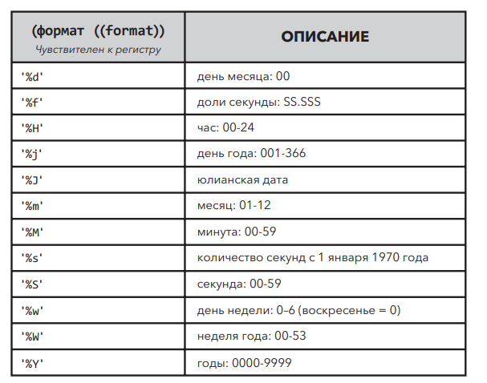
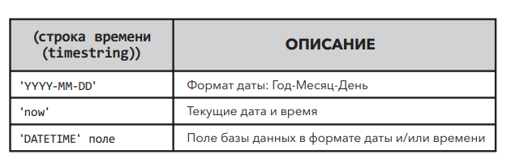
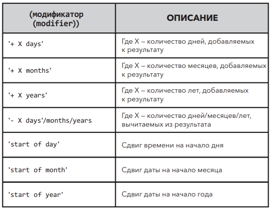

## Добавление вычислений к запросам ## 

Используя функцию `COUNT()`, можно произвести подсчет LastName и использовать псевдоним NameCount для возврата значения.
Добавим функцию к базовому оператору `SELECT`:

```sqlite
SELECT COUNT(LastName) AS [NameCount]
FROM customers
WHERE LastName LIKE 'B%'
```

## Типы функций в SQL ##

Функции в SQL — это специальные ключевые слова, которые принимают определенные параметры, выполняют определенные
операции (например, вычисление или изменение данных в поле) и возвращают результат в виде значения.

Наиболее распространенные и полезные.



- Строковые функции изменяют символьные и текстовые данные.
- Функции даты и времени изменяют данные времени и даты.
- Агрегатные функции выполняют математические операции.

Функции в SQL работают подобно функциям в программах для работы с электронными таблицами и в других языках
программирования.

**_ПРИМЕЧАНИЕ_**
_Часть функции в круглых скобках (X) называется аргументом функции. Некоторые функции могут содержать более одного
аргумента._

Практические задания

* Функция UPPER() принимает только один аргумент (X). Сколько аргументов
  принимает функция REPLACE()? (3)
  Пример:

```sqlite
SELECT REPLACE('SQL Tutorial', 'T', 'M');

-- RESULT
-- SQL Mutorial
```

## Управление текстовыми данными с помощью строковых функций ##

Строка — это еще одно название для текстовых данных. Строковые функции позволяют форматировать и изменять текст.

Для символьных данных фиксированной длины (например, почтовых индексов, содержащих буквы) можно использовать другой тип
данных — с фиксированной длиной.

Допустим, нас попросили создать список рассылки по клиентам из США. Для этого необходимо получить имена и адреса
клиентов. Используем оператор `SELECT`

```sqlite
SELECT FirstName,
       LastName,
       Address
FROM customers
WHERE Country = 'USA';
```

Однако возникают некоторые проблемы. Данные адреса разбиты на части. Просто запросить поле адреса недостаточно. Нам
также необходимо выбрать поля City, State и PostalCode. Другая проблема: все эти данные содержатся в отдельных полях.
Если необходимо создать простой список рассылки, где каждая строка представляет собой полное имя и адрес клиента, то для
этой цели полученный шаблон не годится. Для манипулирования текстовыми строками существует несколько отличных
инструментов, так что мы можем получить результат в удобном для нас виде. Рассмотрим первый из этих инструментов —
конкатенацию

### Конкатенация строк ###

Конкатенация — объединение двух или более строк. Для слияния двух полей вместе используется символ ||. Например,
следующий код выполняет объединение полей FirstName и LastName.

```sqlite
SELECT FirstName || LastName
FROM customers
WHERE CustomerId = 1;
```

Оператор конкатенации || просто соединил оба поля вместе без пробелов. Для удобства чтения мы можем последовательно
использовать две конкатенации и заключить пробел в одинарные кавычки. Тогда запрос будет выглядеть следующим образом:

```sqlite
SELECT FirstName,
       LastName,
       FirstName || ' ' || LastName AS [Full Name]
FROM customers
WHERE Country = 'USA';
```

_В других реализациях SQL существует функция CONCAT() или используется символ +. Синтаксис может отличаться в
зависимости от того, какую РСУБД вы используете, но эффект будет одинаковым_

Рассмотрим следующий пример, где для создания в одной строке имени и адреса клиента используется множественная
конкатенация.

```sqlite
SELECT FirstName || ' ' || LastName || ' ' || Address || ', ' || City || ', ' || State || ' ' || PostalCode
           AS [MailingAddress]
FROM customers
WHERE Country = 'USA';
```

_Пробелы между символами || не обязательны. В предыдущем примере, чтобы получить желаемый формат, мы использовали
запятую, а затем пробел. Вы можете добавить любой текст, поместив его в кавычки._

### Обрезка строки ###

Символы в каждой строке нумеруются, начиная с 1. Это важно при работе со строками, так как позволяет указать фрагмент
строки, используя порядковый номер символа.

Мы используем функцию `LENGTH()` в таком поле, как `PostalCode` (таблица `customers`), и видим, что длина каждого кода
может
быть вычислена.

```sqlite
SELECT PostalCode,
       length(PostalCode) AS [Posatal Code Length]
FROM customers
WHERE Country = 'USA';
```

Анализируя результаты, мы видим, что почтовые индексы различаются размером строк. Минимальная необходимая длина
почтового индекса США — пять цифр. С помощью функции _SUBSTR()_ удалим всю информацию после пятой позиции в строке.

Существует два вида функции` SUBSTR()`: `SUBSTR(X, Y)` и` SUBSTR(X, Y, Z)`.



Если для удаления дополнительных данных из почтовых индексов США мы используем функцию SUBSTR (X, Y, Z), аргумент X
будет соответствовать полю PostalCode, а аргумент Y — начальной позиции строки. В данном случае мы хотим, чтобы первые
пять чисел остались, поэтому выберем 1. Аргумент Z указывает количество символов, которые функция вернет из начальной
позиции, в нашем случае оно равно 5. Если мы выберем только адреса США, а затем добавим функцию SUBSTR (X, Y, Z) с
псевдонимом, мы получим следующее:

```sqlite
SELECT PostalCode,
       substr(PostalCode, 1, 5) AS [Five Digit Postal Code],
       CASE
           WHEN length(substr(PostalCode, 1, 4)) >= '4' THEN substr(PostalCode, 7, 1)
           end                  AS [ZIP + 4 Code]
FROM customers
WHERE Country = 'USA';
```

Мы также можем разделить данные, используя функцию `SUBSTR()`. Обратите внимание, что версия функции `SUBSTR()`,
принимающей
два аргумента, возвращает все символы до конца строки, начиная с позиции Y. Если позиция Y не начинается с 1, мы можем
указать функции, чтобы она возвращала только символы, начиная с позиции Y и далее.

#### Дополнительные строковые функции ####



Функция UPPER(X) возвращает копию входной строки X, в которой все символы ASCII в нижнем регистре переведены в верхний
регистр. Функция LOWER() переводит все символы аргумента в нижний регистр. Рассмотрим пример использования этих функций:

```sqlite
SELECT FirstName                                  as [First name Unmodified],
       UPPER(FirstName)                           as [First Name in UPPERCASE],
       LOWER(FirstName)                           as [First Name in lowercase],
       UPPER(FirstName) || ' ' || UPPER(LastName) AS [Full Name in UPPERCASE]
FROM customers
```

В данном запросе в качестве аргумента функций UPPER() и LOWER() выступает поле FirstName. Также для обозначения
результата мы использовали псевдоним Full Name, чтобы показать, что вы можете объединить два поля после выполнения
функций. Функции UPPER() и LOWER() работают только с символами ASCII. Любые символы, изначально отформатированные в
Юникоде, остаются без изменен.

```markdown
* _Используйте функцию SUBSTR() вместе с функциями UPPER() и LOWER() и создайте список клиентов: фамилия должна быть
  выведена первой и всеми заглавными буквами, а от имени следует оставить только первую букву._
```

```sqlite
SELECT UPPER(FirstName) || ' ' || UPPER(LastName) || ' '
           || Address || ', ' || City || ', ' || State || ' '
           || SUBSTR(PostalCode, 1, 5) AS [MailingAddress]
FROM customers
WHERE Country = 'USA'
```

### Функции даты и времени ###

Функции даты и времени позволяют управлять данными, хранящимися в различных форматах даты и времени. В базе данных
sTunes информация о дате хранится в формате `DATETIME: YYYY-MM-DD HH:MM:SS.` Хотя формат позволяет вводить временной
код, он не используется в нашей базе данных — все временные коды пусты и отображают 00:00:00. Поэтому, чтобы убрать
временной код и оставить только информацию о дате, мы использовали функцию `DATE()`.

Поскольку в разных базах данных информация о дате может храниться по-разному, важно знать, как преобразовать один формат
в другой. С датами мы можем сделать гораздо больше, чем просто изменить их формат. Например, чтобы вычислить возраст
сотрудников, мы можем посчитать разницу между любой заданной и текущей датой, поскольку в таблице `employees` имеется
поле `BirthDate` (Дата рождения).

Чтобы рассчитать возраст сотрудников, рассмотрим функцию `STRFTIME()`, также известную
как функция времени в строковом формате. Она позволяет отформатировать информацию о времени и дате в виде текстовой
строки. Для корректной работы функции `STRFTIME()` требуется как минимум информация двух видов.
Необходимо указать желаемый формат (его называют спецификацией преобразования) и строку времени для форматирования.
Строку времени можно ввести вручную или использовать поле `DATETIME`. В качестве аргумента строка времени также может
использовать функцию `NOW`. Третий аргумент, модификатор, необязательный и может применяться для дискретного сдвига даты
вперед или назад и выполнения некоторых других функций.


Функцию `NOW` иногда называют недетерминированной функцией. Это означает, что результирующие данные, возвращаемые этой
функцией, будут разными при каждом ее вызове, поскольку дата и/или время будут разными при каждом вызове. Функция
`STRFTIME()` и большинство других функций, описанных в этой книге, — детерминированные. То есть они дают один и тот же
результат каждый раз, когда используются с одними и теми же аргументами. Функцию `NOW` необходимо постоянно обновлять,
чтобы она оставалась точной, и результат соответствовал времени вашего компьютера.

Функция `STRFTIME()` способна выполнять различные преобразования времени и дат. Если вы пока не совсем понимаете
значения
всех аргументов и выполняемых преобразований, не беспокойтесь. Главное то, что функция `STRFTIME()` принимает данные в
формате времени и даты и использует ключевые слова для возврата определенных пользователем фрагментов даты.

### АРГУМЕНТЫ ФУНКЦИИ STRFTIME ###







Можно использовать любые символы внутри одинарных кавычек при условии, что всю строку заключаем в кавычки

```sqlite
SELECT STRFTIME('TheYear is: %Y The Day is: %d The Month is %m', '2011-05-22') AS [Text with Conversion Specifications];
```

Спецификация в функции преобразования всегда начинается с символа `%`, за которым следует чувствительный к регистру
буквенный символ. Использование, например, `%M` (верхний регистр) вместо `%m` даст нам минуты вместо месяцев

Давайте рассмотрим работу функции `STRFTIME()` на примере вычисления возраста сотрудников. Первое, что необходимо
сделать, это указать необходимый формат. Поскольку `BirthDate` (Дата рождения) имеет тип данных `DATETIME`, а время в
нашей базе данных не указано, для простоты опустим временные коды.
Чтобы узнать возраст сотрудников, вычислим разницу во времени между датой рождения каждого сотрудника и текущей датой.
Текущую дату можно получить, используя функцию `NOW`

```sqlite
SELECT LastName,
       FirstName,
       STRFTIME('%Y-%m-%d', BirthDate)                               AS [Birthday No Timecode],
       STRFTIME('%Y-%m-%d', 'now') - STRFTIME('%Y-%m-%d', BirthDate) AS [Age]
FROM employees
ORDER BY Age
```

Мы можем использовать функцию `STRFTIME()` так же, как мы использовали функцию `DATE()` для удаления временных кодов.
Затем, чтобы узнать возраст сотрудников, необходимо получить разницу между двумя функциями strftime.

```markdown
* Компания sTunes отмечает дни рождения сотрудников первого числа каждого месяца. Создайте для отдела кадров таблицу,
  отображающую имена сотрудников, дни рождения и день празднования.

* Отдел кадров компании sTunes сообщил нам, что возраст сотрудников — это тема весьма деликатная. Перепишите этот
  запрос, чтобы в результате получить количество лет работы каждого сотрудника в компании.

* Какой сотрудник проработал в компании дольше всех?
```

```sqlite
SELECT LastName,
       FirstName,
       STRFTIME('%Y-%m-%d', 'now') - STRFTIME('%Y-%m-%d', HireDate) AS [Hire Age]
FROM employees
ORDER BY HireDate
```

### Агрегатные функции ###

Агрегатные функции воздействуют на значения столбца, чтобы получить единое результирующее значение с помощью различных
математических операций. В начале этой главы, чтобы вычислить количество клиентов с фамилией, начинающейся с буквы B, мы
использовали функцию `COUNT()`. Существует множество практических способов использования агрегатных функций. Так,
используем функцию `SUM()` в таблице invoices для вычисления итоговой суммы всех счетов

```sqlite
SELECT SUM(Total) AS [Total Sales]
FROM invoices
```

Существует множество агрегатных функций, но здесь мы рассмотрим пять основных функций в SQL: `SUM()`, `AVG()`, `MIN()`,
`MAX()` и `COUNT()`.

| ФУНКЦИЯ   | ОПИСАНИЕ                                                  |
|-----------|-----------------------------------------------------------|
| `SUM()`   | Возвращает суммарное значение столбца таблицы базы данных |
| `AVG()`   | Возвращает среднее значение для столбца                   |
| `MIN()`   | Возвращает минимальное значение для столбца               |
| `MAX()`   | Возвращает максимальное значение для столбца              |
| `COUNT()` | Возвращает количество записей таблицы базы данны          |

**ПРИМЕР:**

```sqlite
SELECT SUM(Total) AS TotalSales,
       AVG(Total) AS AverageSales,
       MAX(Total) AS MaximumSale,
       MIN(Total) AS MinSale,
       COUNT(*)   AS SalesCount
FROM invoices
```

По умолчанию функция COUNT() возвращает только ненулевые значения. Однако если необходимо подсчитать все записи, даже
записи с ошибками или нулевыми значениями, рекомендуется использовать символ звездочки * или поле первичного ключа.
Символ звездочки * обозначает «вернуть все записи». Поэтому, используя ее с агрегатной функцией COUNT(), мы получим
количество всех записей в таблице invoices.

```markdown
Практические задания

* Сколько счетов содержится в таблице invoices?

* Какова средняя сумма счета?

* Какова сумма самого большого счета в таблице invoices?
```

```sqlite
------------------------------------------------------------------------------------------------------------------------
SELECT COUNT(Total) AS Total
FROM invoices;
------------------------------------------------------------------------------------------------------------------------
SELECT AVG(Total) AS TotalSales
FROM invoices;
------------------------------------------------------------------------------------------------------------------------
SELECT MAX(Total) AS TotalSales
FROM invoices;
------------------------------------------------------------------------------------------------------------------------
```

### Вложенные функции на примере ROUND() ###

Вложенная функция — это та, которая содержится в другой функции. Одна из целей использования вложенных функций —
модифицировать формат внутренней функции. Если мы проанализируем предыдущий пример, в котором мы использовали функцию
`AVG()`, то увидим, что `Average Sales` (средний объем продаж) содержит слишком много десятичных знаков. Такой формат
обычно не используется для денежных единиц. Функция `ROUND()`, хотя и не агрегатная, очень полезна при выполнении
каких-либо математических операций или если требуется привести в порядок результаты. Для этой цели функцию `AVG()` можно
поместить в функцию `ROUND()` (это и есть вложение) и указать количество десятичных знаков, до которого мы хотим
округлить результат.

| ФУНКЦИЯ    | ОПИСАНИЕ                                                                                                                              |
|------------|---------------------------------------------------------------------------------------------------------------------------------------|
| ROUND(X,Y) | Функция ROUND() округляет число X до указанного числа десятичных знаков Y. Если аргумент Y отсутствует, это означает, что он равен 0. |

```sqlite
SELECT AVG(Total)           AS [Average Sales],
       ROUND(AVG(Total), 2) AS [Rounded Average Sales]
FROM invoices;
```

При использовании функции ROUND() с денежными единицами будьте внимательны при округлении и изменении значениях в
промежуточных вычислениях. Обычно округление выполняется только на последнем шаге. Также вы можете добавить комментарии,
чтобы указать, что результаты округляются до двух знаков после запятой.

### Использование агрегатных функций и условия `GROUP BY` ####

Полезной особенностью агрегатных функций считается их способность вычислять промежуточные значения, или агрегаты, для
различных групп данных. Для таблицы `invoices` в базе данных **_sTunes_** мы можем легко получить среднюю сумму счета с
помощью
функции `AVG()`. Предположим, компании _**sTunes**_ необходимо рассчитать среднюю сумму счета для каждого города, где
его выставили.

ВНИМАНИЕ
Следующий запрос написан неправильно, чтобы показать, что происходит при сочетании в операторе **SELECT** агрегатных
функций
с неагрегатными полями. Этот запрос не вызывает ошибок, но он неправильно отображает запрашиваемую информацию.

```sqlite
SELECT BillingCity,
       AVG(Total)
FROM invoices
ORDER BY BillingCity;
```

Нам требовалось получить среднюю сумму счета из таблицы `invoices` для каждого города. Несмотря на то, что мы включили
город в оператор `SELECT`, запрос по-прежнему дает нам только глобальное среднее значение всех счетов. Почему наш запрос
не возвращает среднюю сумму для каждого города из таблицы `invoices`?

Чтобы решить эту задачу, давайте проанализируем запрос. Нам задали вопрос: какова средняя сумма счетов по городам?

Мы уже упоминали, что полезно разбивать запрос на компоненты, а также поразмыслить, какая таблица содержит нужную
информацию и как ее отобразить. Ответ на эти два вопроса поможет вам устранить недочеты, связанные с запросом, который
возвращает некорректную информацию.

В предыдущем (некорректном) запросе мы запросили у браузера SQL два вида информации из таблицы `invoices`. Сначала —
перечислить все города в поле `BillingCity`. Затем — вычислить среднее значение поля `Total`. Результат выполнения
первого
запроса — многострочный ответ, а результат второго — однострочный ответ. Другими словами, мы указываем браузеру
отображать одновременно как агрегатные, так и неагрегатные поля. Мы не получили необходимую информацию, так как
неправильно сформулировали вопрос.

Исправить эту проблему можно, добавив в запрос условие GROUP BY следующим образом:

```sqlite
SELECT BillingCity,
       AVG(Total)
FROM invoices
GROUP BY BillingCity
ORDER BY BillingCity
```

Анализируя выполнение запроса мы видим, что все города, где были выставлены счета, в нашем наборе результатов теперь
появляются один раз и для каждого города отображается среднее значение счета.

```markdown
Практическое задание

* В данный запрос добавьте функцию ROUND(), чтобы округлить средние значения до двух десятичных знаков.
```

```sqlite
SELECT BillingCity,
       AVG(Total),
       round(AVG(Total), 2)
FROM invoices
GROUP BY BillingCity
ORDER BY BillingCity
```

### Использование условий `WHERE` и `HAVING` со сгруппированными запросами ###

Добавление критериев в сгруппированный запрос работает так же, как и с другими, уже знакомыми нам запросами.
Использование условия `WHERE` позволяет нам добавлять новые критерии. В примере ниже критерии добавляются для
неагрегатного поля `BillingCity`.

```sqlite
SELECT BillingCity,
       AVG(Total)
FROM invoices
WHERE BillingCity LIKE 'L%'
GROUP BY BillingCity
ORDER BY BillingCity
```

Неагрегатное поле — это просто поле в условии SELECT, которое вызывается без агрегатной функции.

```markdown
Практическое задание

* Сколько городов, где были выставлены счета, начинаются с буквы L?

(3)
```

В последнем примере мы добавили критерии в неагрегатное поле. Может возникнуть необходимость использовать критерии для
агрегированных полей, например AVG(Total). Скажем, когда нам надо найти все средние значения, меньшие 20. Мы могли бы
попытаться ответить на этот вопрос с помощью условия WHERE, но существует одна проблема.

Следующий оператор SQL содержит ошибку. Но важно видеть, что критерии, созданные в условии WHERE, не работают с
агрегатными данными.

```sqlite
SELECT BillingCity,
       AVG(Total)
FROM Invoices
WHERE AVG(Total) > 5 < - (критерии, созданные в условии WHERE, не работают с агрегатными данными)
GROUP BY BillingCity
ORDER BY BillingCity
```

При выполнении запроса возникнет следующее сообщение об ошибке:

```commandline
Misuse of aggregate: AVG()
```

**(Неправильное использование агрегата: AVG())**

Это сообщение об ошибке информирует нас, что для создания условия на основе агрегатной функции (по крайней мере, в
данном случае) мы не можем использовать условие `WHERE`. В данном случае условие `WHERE` может указывать только, какую
информацию извлекать из полей, указанных в условии `SELECT`. Если необходима дополнительная фильтрация на основе
агрегатных функций, необходимо включить вторичную фильтрацию, известную как условие `HAVING`. Условие `HAVING` всегда
следует после условия `GROUP BY`. Измененный запрос теперь выглядит следующим образом:

```sqlite
SELECT BillingCity,
       AVG(Total)
FROM invoices
GROUP BY BillingCity
HAVING AVG(Total) > 5
ORDER BY BillingCity;
```

Условие `HAVING` позволяет фильтровать результат группировки, сделанной с помощью команды `GROUP BY`. Условие `HAVING`
фильтрует агрегированные данные. Если вы попытаетесь использовать `HAVING` без условия `GROUP BY`, то получите сообщение
об ошибке.

### Условия WHERE и HAVING ###

Если кратко, то разница между условиями `WHERE` и `HAVING` заключается в том, что `WHERE` предназначено для фильтрации
неагрегатных данных, а `HAVING` — для фильтрации результатов, содержащих агрегаты. Если более подробно, то два
типа фильтрации возникают, когда в запрос включены как условие `WHERE`, так и условие `HAVING`.
Условие `WHERE` указывает запросу, какую информацию следует исключить из таблицы, а затем, после фильтрации данных и
применения к полям агрегатных функций, условие `HAVING` действует как дополнительный фильтр для агрегатных данных.
Давайте повторим предыдущий запрос, но на этот раз выберем только города, начинающиеся с буквы `B`, а затем из этого
списка отфильтруем счета, среднее значение которых больше пяти.

```sqlite
SELECT BillingCity,
       AVG(Total)
FROM invoices
WHERE BillingCity LIKE 'B%'
GROUP BY BillingCity
HAVING AVG(Total) > 5
ORDER BY BillingCity
```

В запросе мы выполнили ту же задачу, но на этот раз добавили условие `WHERE` для фильтрации результатов только по
городам, начинающимся с буквы B. Данный этап фильтрации выполняется до обработки условий `HAVING` и `ORDER BY`. Так как
нам необходимо выполнить фильтрацию, прежде чем мы сможем группировать, то порядок условий фильтрации важен, а условие
WHERE всегда предшествует `HAVING`.

### Группировка по нескольким столбцам ###

В условиях GROUP BY можно одновременно указывать столько столбцов, сколько вам требуется. Предположим, необходимо
получить более подробную разбивку средних значений счетов. Мы можем написать запрос так, чтобы агрегированные данные
были сначала сгруппированы по странам, а затем по городам. В приведенном ниже примере мы добавим в условие GROUP BY еще
одно поле, BillingCountry. Давайте посмотрим, как работает запрос.

```sqlite
SELECT BillingCountry,
       BillingCity,
       AVG(Total)
FROM invoices
GROUP BY BillingCountry, BillingCity
ORDER BY BillingCountry
```

И мы видим, что у нас имеется несколько записей для одной страны выставления счета, а отдельные города указаны в
соседнем столбце. Группировка по нескольким столбцам может быть очень полезна, когда необходимо получить более детальную
информацию.

Файлы базы данных могут содержать орфографические и/или ошибки, связанные с регистром

### Несколько заключительных слов о функциях ###

Цель этой главы — познакомить вас с функциями. Мы описали возможности некоторых функций, их способность превращать
данные в информацию и решать практические задачи. Если бы пришлось рассматривать все функции в **SQLite**
и иллюстрировать работу каждой из них, то эту книгу мне никогда не удалось бы закончить. К счастью, в интернете можно
найти массу информации о функциях **SQL** и их использовании. Я всегда рекомендую студентам поискать информацию о
функциях в интернете, чтобы увидеть разные примеры их использования. Надеюсь, что вы продолжите обучение самостоятельно
и узнаете еще больше о том, как использовать эти мощные инструменты.

#### Контрольные вопросы

1. Создайте однострочный список рассылки для всех клиентов из США,
   включая полные имена, написанные заглавными буквами, и полные адреса
   с пятизначными почтовыми индексами, в следующем формате:
   FRANK HARRIS 1600 Amphitheatre Parkway, Mountain View, CA 94043
2. Каковы средние годовые продажи клиентам из США согласно имеющимся
   данным за все годы?
3. Каков общий объем продаж компании за все время?
4. Кто входит в десятку лучших клиентов с точки зрения совершенных ими
   покупок? Подсказка: чтобы ответить на этот вопрос, необходимо использовать соединение (глава 6).

Резюме

- Функции позволяют изменять, форматировать и выполнять вычисления с данными в таблицах.
- Запросы, содержащие числовые данные, можно обрабатывать с помощью различных арифметических операций и агрегатных
  функций.
- Запросы, содержащие текст, можно разделить, объединить, использовать для них заглавные буквы и т. д.
- После агрегирования данные можно дополнительно отсортировать с помощью условий GROUP BY и HAVING.
- Условие HAVING работает с агрегатными полями так же, как условие WHERE
  с неагрегатными.
- Условие HAVING можно использовать в запросе, только если имеется условие
  GROUP BY.
- Условие GROUP BY можно использовать с несколькими полями, чтобы еще
  больше детализировать агрегатные данные.
