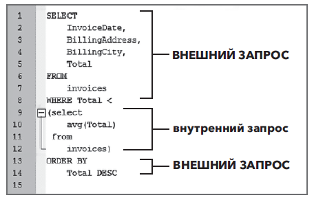

## Подзапросы ##

Под запрос — это просто один запрос, вложенный в другой. Под запрос обычно добавляется в условия `SELECT`, `FROM`
или `WHERE`.
Использование под запросов полезно, когда запрос, который мы хотим создать, требует нескольких дополнительных шагов или
вычислений для создания ожидаемого набора данных.

Например, подзапросы очень полезны в сценариях, когда мы хотим просмотреть или сравнить запрос по условию, для
вычисления которого требуется собственный запрос. Чтобы не писать один запрос, а затем копировать результаты в
следующий, мы можем использовать подзапрос, выполняющий обе операции одновременно. Подзапросы также предоставляют нам
другой метод одновременного доступа к данным из нескольких таблиц. Хотя использование подзапроса не так эффективно, как
соединение (join), он позволяет нам выполнить вычисление в одной таблице, а затем использовать это вычисление в другой
таблице.

### Использование агрегатных функций в подзапросах ###

```sqlite
SELECT ROUND(AVG(Total), 2) AS [Average Total]
FROM invoices;
```

Мы видим, что в примере запроса средняя сумма счета из таблицы invoices составляет $5,65. Предположим, компания sTunes
попросила нас собрать данные обо всех счетах, сумма которых меньше этого среднего значения. Прежде всего, необходимо
использовать оператор `SELECT`, который выводит отдельные поля счета (
например, `InvoiceDate`, `BillingAddress`, `BillingCity`
и, конечно же, `Total`). Затем отфильтруем полученные результаты, сравнив их с агрегатной функцией. Используем условие
`WHERE`, чтобы сравнить поле `Total` с полем `AVG(Total)`. В предыдущей главе вы узнали, что попытка использования
условия
`WHERE Total<AVG(Total)` в условии `WHERE` для прямого сравнения приводит к ошибке `misuse of aggregate function` (
неправильное использование агрегатной функции). Итак, нам надо взять указанный выше запрос и вставить его в другой
запрос, который сортирует счета по итоговой сумме. И, к счастью, есть простой способ сделать это.

Начнем с базового оператора `SELECT`, а затем, используя круглые скобки (), вставим весь приведенный выше запрос в
условие
`WHERE`, заставляя его функционировать как подзапрос.

```sqlite
SELECT InvoiceDate,
       BillingAddress,
       BillingCity,
       Total
FROM invoices
WHERE Total <
      (SELECT AVG(Total)
       from invoices)
ORDER BY Total DESC;
```

Запрос, заключенный в круглые скобки, называется внутренним запросом, он и станет частью условия `WHERE` нашего внешнего
запроса.



### Использование подзапроса в операторе SELECT ###

Если в операторе `SELECT` требуется добавить дополнительное действие (например, агрегатное вычисление), то для его
выполнения нам понадобится подзапрос. В предыдущей главе, посвященной функциям, показано, что для отображения средних
значений в счетах для разных городов мы использовали условие GROUP BY. Что будет, если для компании sTunes нам надо
узнать показатели продаж в каждом отдельном городе и сравнить их со средними мировыми продажами? Один из способов
ответить на это — написать запрос, который будет отображать средний объем продаж в каждом городе рядом со среднемировым
показателем.

Запрос для отображения среднего объема продаж `BillingCity` идентичен запросу, который мы использовали в предыдущей
главе,
за одним исключением. Для расчета глобального среднего показателя мы включаем подзапрос в условие `SELECT`. Таким
образом,
мы можем сравнить два значения.

```sqlite
SELECT BillingCity,
       AVG(Total)      AS [City Average],
       (SELECT round(avg(total), 2)
        from invoices) AS [Global Average]
FROM invoices
GROUP BY BillingCity
ORDER BY BillingCity
```

Результат этого запроса показывает, как продажи в каждом городе соотносятся со среднемировым уровнем.

### Использование подзапроса с условием WHERE ###

Иногда надо получить более подробный запрос в качестве подзапроса. Внешний запрос может содержать условие WHERE,
которое, в свою очередь, содержит подзапрос с собственным условием WHERE. Хороший пример того, когда в подзапросе
необходимо использовать условие WHERE, если требуется сравнить все поля с отдельным значением. Предположим, нас
попросили найти самые большие продажи за весь период сбора данных (2009–2012 гг.) и проверить, имеются ли какие-либо
итоговые суммы счетов за последний отчетный год (2013 г.), превышающие это значение. Чтобы ответить, сначала необходимо
узнать самые большие продажи до 2013 года. Для этого воспользуемся функцией MAX().

```sqlite
SELECT MAX(Total)
FROM invoices
WHERE InvoiceDate < '2013-01-01';
```

Теперь, когда нам известно это значение, мы заключим запрос в круглые скобки (), а затем добавим внешний запрос и
вставим необходимые дополнительные поля.

```sqlite
SELECT InvoiceDate,
       BillingCity,
       Total
FROM invoices
WHERE InvoiceDate >= '2013-01-01'
  AND total >
      (select max(Total)
       from invoices
       where InvoiceDate < '2013-01-01')
```

### Подзапросы без агрегатных функций ###

Подзапрос не всегда содержит агрегатную функцию. Следующий запрос отображает дату конкретной транзакции.

```sqlite
SELECT InvoiceDate
FROM invoices
WHERE InvoiceId = 251
```

Если необходимо узнать, получены ли какие-либо другие счета после указанного выше счета, мы добавим подзапрос,
заключенный в круглые скобки, а затем добавим внешний запрос.

### Возврат нескольких значений из подзапроса ###

До этого момента мы использовали только подзапросы для вычисления единственного значения, которое затем передается
внешнему запросу. Также можно использовать подзапросы, возвращающие несколько записей. Допустим, руководство компании
sTunes хочет получить только три конкретных счета. Чтобы их выбрать, нужен следующий запрос:

```sqlite
SELECT InvoiceDate
FROM invoices
WHERE InvoiceId IN (251, 252, 255);
```

В предыдущем запросе для возврата трех дат из таблицы invoices используется условие IN: 2012-01-09, 2012-01-22 и
2012-01-24. Теперь предположим, что нам нужна информация о покупках за эти три дня. Если необходимо выбрать все счета за
эти три дня, мы можем написать новый запрос или просто использовать предыдущий в качестве подзапроса, например:

```sqlite
SELECT InvoiceDate,
       BillingAddress,
       BillingCity
FROM invoices
WHERE InvoiceDate IN
      (SELECT InvoiceDate
       from invoices
       where InvoiceId in (251, 252, 255));
```

Преобразование существующего запроса в подзапрос полезно, когда вы «играете» со своими данными. Чтобы еще больше сузить
область поиска, этот метод позволяет повторно использовать существующий запрос и изменять его.

### Подзапросы и условие DISTINCT ###

Другие примеры в этой главе показывают, что подзапросы очень полезны для сценариев, где надо просмотреть или сравнить
запрос по условию, для вычисления которого требуется собственный запрос. Как вы уже знаете из главы 1, в каждой таблице
есть одно уникальное поле, первичный ключ, содержащее уникальный номер для каждой записи, но другие поля могут содержать
избыточную информацию. Для удобства работы с избыточной информацией стоит отфильтровать данные, чтобы они отображали
только уникальные значения. В этом случае полезно условие DISTINCT. Лучше понять подзапросы и использование условия
DISTINCT нам помогут таблицы tracks и invoice_items.

Таблица invoice_items показывает, какие треки какому счету соответствуют. Если мы создадим запрос, отображающий поля
InvoiceId и TrackId, упорядоченные по TrackId, мы увидим, что определенные номера треков были заказаны несколько раз в
разных счетах.

```sqlite
SELECT InvoiceId,
       TrackId
FROM invoice_items
ORDER BY TrackId;
```

Так, треки № 2 и № 8 появляются в нескольких счетах, что означает, что они были заказаны несколько раз (рис. 121).
Однако для трека № 7 счет отсутствует, поэтому мы можем сделать вывод, что никто не приобретал его. Руководство sTunes
хочет знать о треках, которые не продаются. Нам необходимо найти таблицу, связывающую поля TrackId с InvoiceId. Для
перечисления всех треков (по композитору и названию), которые не отображаются в таблице invoice_items, мы можем
использовать подзапросы. Если мы снова запустим тот же запрос, только на этот раз с ключевым словом DISTINCT, мы получим
список только тех треков, которые появляются в счетах, без дубликатов.

```sqlite
SELECT DISTINCT TrackId
FROM invoice_items
ORDER BY TrackId;
```

Из примера видно, что некоторые номера TrackId (например, № 7) не появляются ни в одном счете, но списки треков, которые
появляются в нескольких счетах, сокращены до одного. Теперь нам необходимо написать запрос, перечисляющий все треки из
таблицы tracks, которые не входят (NOT IN) в созданный первым запросом список.

```sqlite
SELECT TrackId,
       Composer,
       Name
FROM tracks
WHERE TrackId NOT IN
      (select distinct TrackId
       from invoice_items);
```

Итак, у нас есть список песен, которых не было ни в одном счете (рис. 123). Анализируя полученные результаты, мы видим,
что трек № 7 находится в самой верхней части списка непродаваемых треков. Теперь отдел продаж sTunes имеет четкое
представление о том, какие песни непопулярны. Примеры подзапросов из этой главы не являются исчерпывающими. Существует
еще множество вариантов использования подзапросов, и все они имеют общие особенности. Подзапросы могут выполнять сложные
многоступенчатые вычисления с помощью всего одного запроса. Они позволяют вычислить конкретное условие, а затем сравнить
новый набор данных с тем же условием.

``` text
ПРИМЕЧАНИЕ
Подзапросы — это альтернативный способ взаимодействия таблиц, имеющих общие ключевые поля. 
Но если нам нужно много работать с обеими таблицами, то вместо подзапросов эффективнее создать join-соединение.
Например, гораздо эффективнее создать соединение между полем TrackId и таблицей tracks (вместо использования подзапросов), чтобы отображать всю информацию рядом.
```

